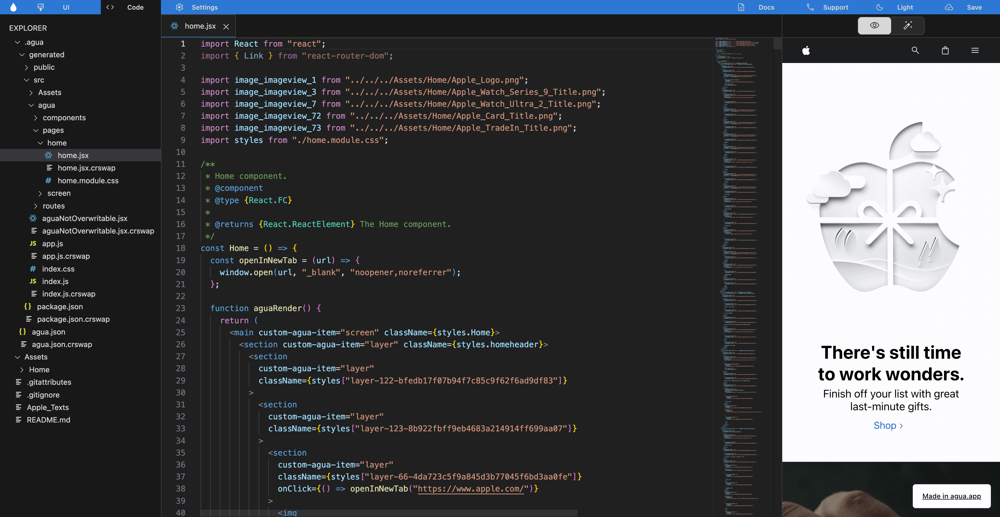
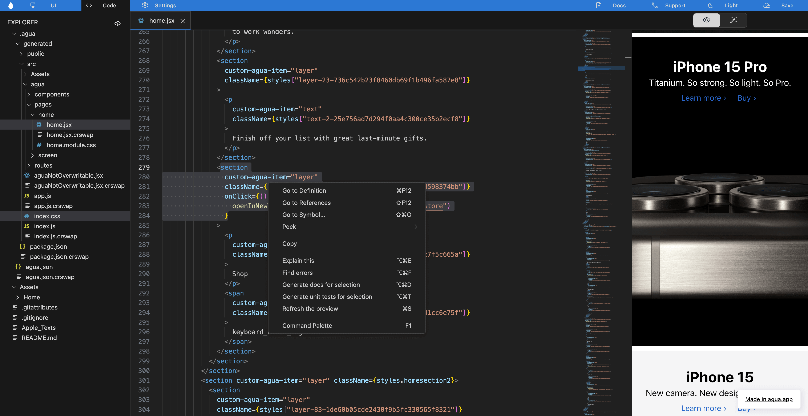

# What is Agua?

Agua is the **free** React Toolkit for front-end developers. You can import, manage and document your components using our AI tools, while using our Graphical Interface to updated and create new **web** user interfaces. **Develop clean code faster and easier!**

## Quick Start

<table data-card-size="large" data-column-title-hidden data-view="cards" data-full-width="false"><thead><tr><th align="center"></th><th data-hidden data-card-target data-type="content-ref"></th></tr></thead><tbody><tr><td align="center"><strong>Start building now!</strong> <a href="getting-started/quick-start/tutorial-airbnb.md"><strong>AirBnb Tutorial</strong></a></td><td><a href="getting-started/quick-start/tutorial-airbnb.md">tutorial-airbnb.md</a></td></tr><tr><td align="center"><strong>Start building now!</strong> <a href="getting-started/quick-start/tutorial-apple.md"><strong>Apple Tutorial</strong></a></td><td><a href="getting-started/quick-start/tutorial-apple.md">tutorial-apple.md</a></td></tr><tr><td align="center"><strong>Learn our Basics!</strong></td><td><a href="getting-started/basics/">basics</a></td></tr><tr><td align="center"><strong>Tour our Platform!</strong></td><td><a href="getting-started/quick-start/platform-tour/">platform-tour</a></td></tr></tbody></table>

## What can you do in Agua?

### 1. Manage your components



**I**mport your [components](references/components.md), and use our preview to: create variants and document them.

<figure><figcaption></figcaption></figure>



### 2. Create web user interfaces



Use your components to update an create new responsive user interfaces. Stylize using the CSS properties of our [graphical editor](references/ui-editor/).

<figure><figcaption></figcaption></figure>



### 3. Export your React Code



All the interfaces you created in our UI editor, are automatically exported into [clean React code](references/code-editor/).

<figure><figcaption></figcaption></figure>



### 4.  Improve your code with AI



Use our [AI tools](references/ai-tools/) to document components, find errors, explain your code to your team, and generate unit tests.

<figure><figcaption></figcaption></figure>



## Learning our Basics&#x20;

<table data-view="cards"><thead><tr><th align="center"></th><th data-hidden data-card-target data-type="content-ref"></th></tr></thead><tbody><tr><td align="center"><strong>Initial Setup</strong></td><td><a href="getting-started/basics/initial-setup.md">initial-setup.md</a></td></tr><tr><td align="center"><strong>Project structure</strong></td><td><a href="getting-started/basics/project-structure/">project-structure</a></td></tr><tr><td align="center"><strong>Project persistence</strong></td><td><a href="getting-started/basics/project-persistence/">project-persistence</a></td></tr><tr><td align="center"><strong>Grid system</strong></td><td><a href="getting-started/basics/grid-system/">grid-system</a></td></tr><tr><td align="center"><strong>Creating responsive UIs</strong></td><td><a href="getting-started/basics/creating-responsive-uis.md">creating-responsive-uis.md</a></td></tr><tr><td align="center"><strong>Design Tokens</strong></td><td><a href="getting-started/basics/design-tokens.md">design-tokens.md</a></td></tr><tr><td align="center"><strong>Creating components</strong></td><td><a href="getting-started/basics/creating-components.md">creating-components.md</a></td></tr><tr><td align="center"><strong>Importing code</strong></td><td><a href="getting-started/basics/importing-code.md">importing-code.md</a></td></tr><tr><td align="center"><strong>Documenting</strong></td><td><a href="getting-started/basics/documenting.md">documenting.md</a></td></tr></tbody></table>

## Preparing for Advanced

<table data-view="cards"><thead><tr><th align="center"></th><th data-hidden data-card-target data-type="content-ref"></th></tr></thead><tbody><tr><td align="center"><strong>Optimizing</strong></td><td><a href="getting-started/advanced/optimizing.md">optimizing.md</a></td></tr><tr><td align="center"><strong>Reusing classes</strong></td><td><a href="getting-started/advanced/reusing-classes.md">reusing-classes.md</a></td></tr><tr><td align="center"><strong>Separating into files</strong></td><td><a href="getting-started/advanced/separating-into-files.md">separating-into-files.md</a></td></tr></tbody></table>

## Reviewing our References

<table data-card-size="large" data-view="cards"><thead><tr><th align="center"></th><th data-hidden data-card-target data-type="content-ref"></th></tr></thead><tbody><tr><td align="center">Learn more about <a href="references/components.md"><strong>Components</strong></a></td><td><a href="references/components.md">components.md</a></td></tr><tr><td align="center">Learn more about our <a href="references/ui-editor/"><strong>UI Editor</strong></a></td><td><a href="references/ui-editor/">ui-editor</a></td></tr><tr><td align="center">Learn more about our <a href="references/code-editor/"><strong>Code Editor</strong></a></td><td><a href="references/code-editor/">code-editor</a></td></tr><tr><td align="center">Learn more about our <a href="references/ai-tools/"><strong>AI Tools</strong></a></td><td><a href="references/ai-tools/">ai-tools</a></td></tr></tbody></table>

## Need Help?

Contact us directly!

* Email [support@agua.dev](mailto:support@agua.dev).
* Book a [meeting with our founders](https://agua.tools/meetings/developers/onboarding).
* Chat with us on [WhatsApp](https://wa.me/12396883277).

Also,

* Visit your [Youtube Channel](https://www.youtube.com/@aguafordevs).
* Check out our [FAQ](help-and-community/faq.md).
* Ask our [community](https://discord.com/invite/hqgEhc8VFN).


**Help us improve our docs!**

* If there are any topics you'd like us to add to our documentation, please share your feedback in our [Roadmap](https://roadmap.agua.app/).
* Edit this page in our [GitHub Repo](https://github.com/Agua-for-devs/agua-documentation) to fix an error or add an improvement to our documentation in a merge request.

