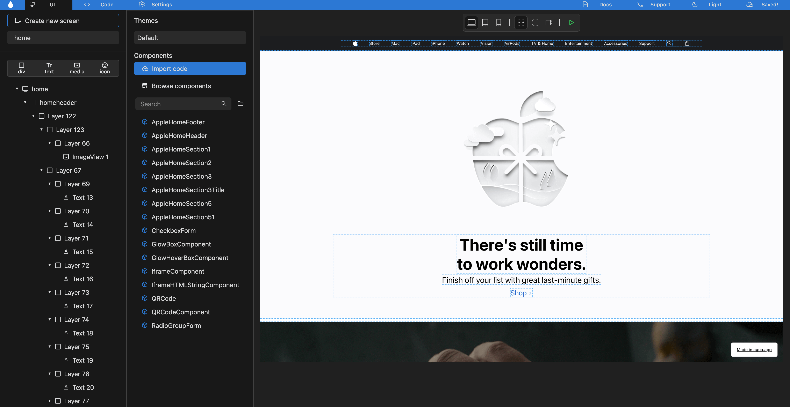

# Saving your project



<figure><figcaption></figcaption></figure>

Ones you have edited your components or user interfaces, you should click the \[_Save_] button in the upper right side of the screen. The button will be updated into \[Saved!] making sure your code is now saved and updated into your local folder.


