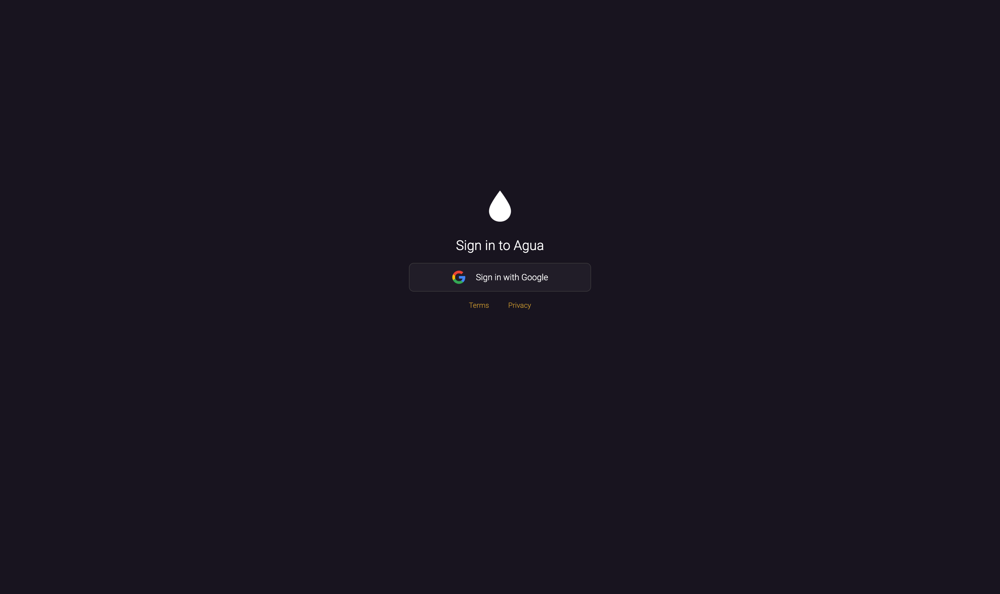
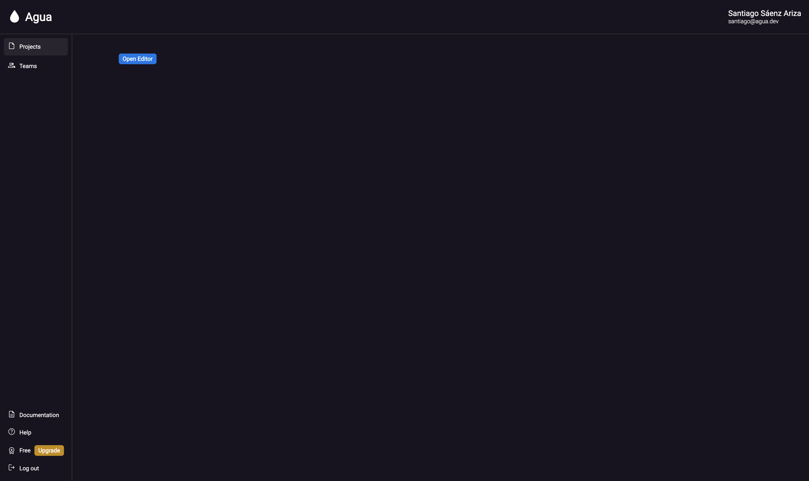

# Create your account

## Create an account.

Create your free account to get started with Agua. After you've set up your account you'll be able to create as many projects as you like.

## Basic Requirements.

Agua is a web app that can be used from your browser.\
Please review these system requirements for the best experience:


* Building on any laptop or desktop is currently supported.
* Agua works only in [Google Chrome](https://www.google.com/intl/es-419/chrome/).
* Allow **editor.agua.app** to [edit the files in your local repository](./#6.-grant-files-permission.).


## Step-by-step

### 1. Enter [auth.agua.app](https://auth.agua.app/signin/).



<figure><figcaption></figcaption></figure>



### &#x20;2. Sign up with Google.



<figure><figcaption></figcaption></figure>



### 3.  Access your dashboard.



<figure><figcaption></figcaption></figure>

Inside your [dashboard](https://console.agua.app/), you'll be able to create new projects by clicking the \[_Open Editor_] button.&#x20;

You can also access:

* \[[_Documentation_](https://docs.agua.dev/)]
* \[[_Help_](https://wa.me/12396883277)]



## Need Help?

Contact us directly!

* Email [support@agua.dev](mailto:support@agua.dev).
* Book a [meeting with our founders](https://agua.tools/meetings/developers/onboarding).
* Chat with us on [WhatsApp](https://wa.me/12396883277).

Also,

* Check out our [FAQ](../../../help-and-community/faq.md).


**Help us improve our docs!**

* If there are any topics you'd like us to add to our documentation, please share your feedback in our [Roadmap](https://roadmap.agua.app/).
* Edit this page in our [GitHub Repo](https://github.com/Agua-for-devs/agua-documentation) to fix an error or add an improvement to our documentation in a merge request.

