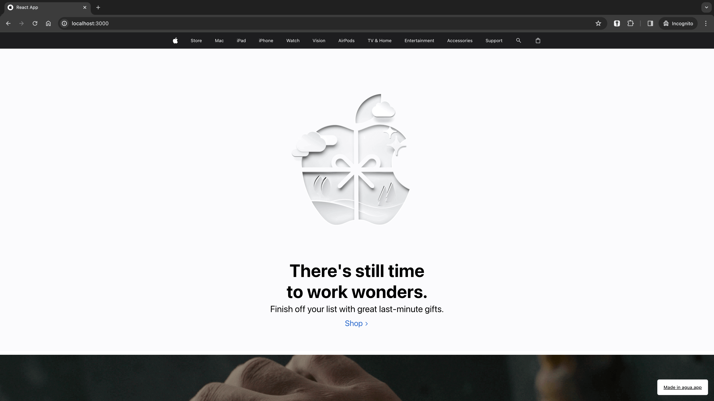

# 3. ToolBar



<figure><figcaption></figcaption></figure>



## 3.1. Views



<figure><figcaption></figcaption></figure>



<figure><figcaption></figcaption></figure>



<figure><figcaption></figcaption></figure>



## 3.2. Layout Borders



<figure><figcaption></figcaption></figure>



<figure><figcaption></figcaption></figure>



## 3.3. Full View



<figure><figcaption></figcaption></figure>



## 3.4. Default SideBar



<figure><figcaption></figcaption></figure>



## 3.5. Preview



<figure><figcaption></figcaption></figure>


