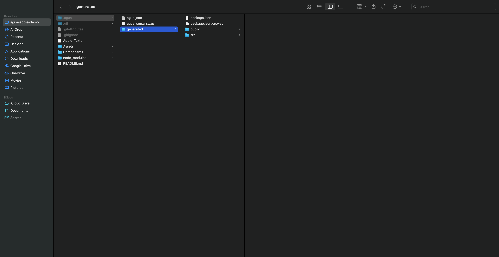

# .agua folder



<figure><figcaption></figcaption></figure>

With your project saved, you can review your code in the selected local folder.\
Your code will be saved in the `.agua` folder.

Within the folder, you will find:

* `agua.json` where your Agua project is saved.
* `generated` where the React code automatically generated by our UI Editor and the code of the your components are saved.&#x20;

In Mac you may no be able to visualize your folder right away, in that case:&#x20;

1. Press the “Command” + “Shift” + “.” (period) keys at the same time.
2. `.agua` will show up as translucent in the local folder.

You can also:&#x20;

1. Click **Spotlight** (the magnifying glass icon in the toolbar or in Finder) and search for **Terminal**. Click the **Terminal** app, which should be the first result. Or, open Finder and navigate to **Applications** > **Utilities** > **Terminal**.
2. In the Terminal text box, type the following script:\
   `defaults write com.apple.Finder AppleShowAllFiles true`\
   (This instructs Finder to reveal all of the hidden files on your Mac.)
3. Then type: `killall Finder`\
   **(**This will restart Finder and apply the changes you made.)

In Windows:

1. Select View > Show > Hidden items.
2. `.agua` will show up as translucent in the local folder.


