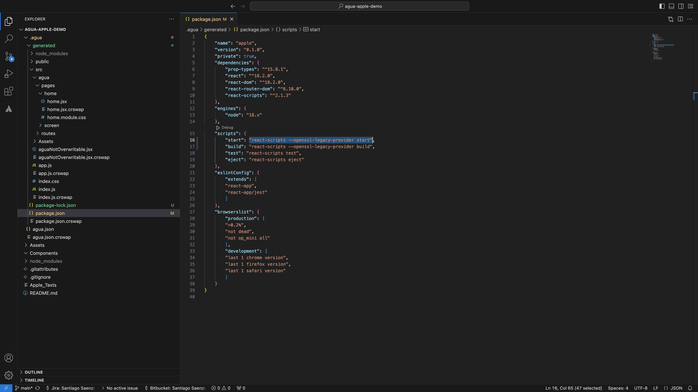

# Deploy Locally



<figure><figcaption></figcaption></figure>

In order to deploy your Agua project locally open the folder in your favorite IDE:

* Replace in the `package.json` the following `"scripts"`:

```json
"start": "react-scripts --openssl-legacy-provider start",
"build": "react-scripts --openssl-legacy-provider build",
```

<figure><figcaption></figcaption></figure>

Then, inside the Terminal:

* `npm install`
* `npm start`

Finally, open your respective localhost tab in Google Chrome.




## Need Help?

Contact us directly!

* Email [support@agua.dev](mailto:support@agua.dev).
* Book a [meeting with our founders](https://agua.tools/meetings/developers/onboarding).
* Chat with us on [WhatsApp](https://wa.me/12396883277).

Also,

* Check out our [FAQ](../../../help-and-community/faq.md).



**Help us improve our docs!**

* If there are any topics you'd like us to add to our documentation, please share your feedback in our [Roadmap](https://roadmap.agua.app/).
* Edit this page in our [GitHub Repo](https://github.com/Agua-for-devs/agua-documentation) to fix an error or add an improvement to our documentation in a merge request.

