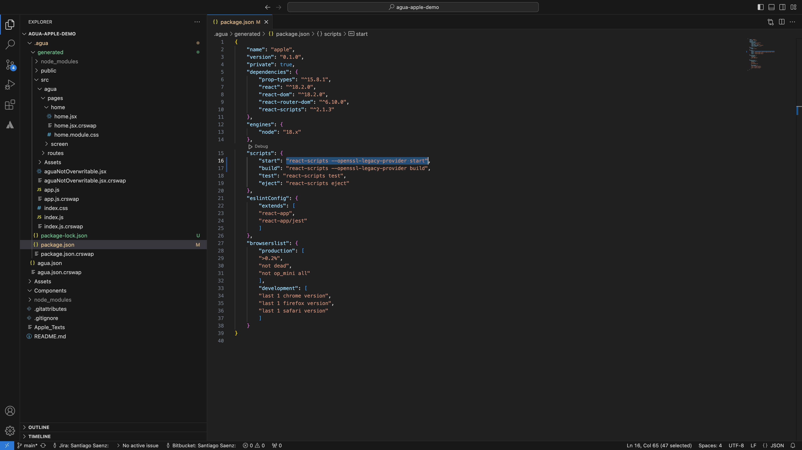

# Save and deploy

## Step-by-step

### 1. Save the project.



<figure><figcaption></figcaption></figure>

Ones you have edited your components or user interfaces, you should click the \[_Save_] button in the upper right side of the screen. The button will be updated into \[Saved!] making sure your code is now saved and updated into your local folder.



### 2. Review your code.



<figure><figcaption></figcaption></figure>

With your project saved, you can review your code in the selected local folder.\
Your code will be saved in the `.agua` folder.

Within the folder, you will find:

* `agua.json` where your Agua project is saved.
* `generated` where the React code automatically generated by our UI Editor and the code of the your components are saved.&#x20;


In Mac you may no be able to visualize your folder right away, in that case:&#x20;

1. Press the “Command” + “Shift” + “.” (period) keys at the same time.
2. `.agua` will show up as translucent in the local folder.

You can also:&#x20;

1. Click **Spotlight** (the magnifying glass icon in the toolbar or in Finder) and search for **Terminal**. Click the **Terminal** app, which should be the first result. Or, open Finder and navigate to **Applications** > **Utilities** > **Terminal**.
2. In the Terminal text box, type the following script:\
   `defaults write com.apple.Finder AppleShowAllFiles true`\
   (This instructs Finder to reveal all of the hidden files on your Mac.)
3. Then type: `killall Finder`\
   **(**This will restart Finder and apply the changes you made.)


In Windows:

1. Select View > Show > Hidden items.
2. `.agua` will show up as translucent in the local folder.



### 3. Deploy your project locally.&#x20;



<figure><figcaption></figcaption></figure>

In order to deploy your Agua project locally open the folder in your favorite IDE:

* Replace in the `package.json` the following `"scripts"`:

```json
"start": "react-scripts --openssl-legacy-provider start",
"build": "react-scripts --openssl-legacy-provider build",
```

<figure><figcaption></figcaption></figure>

Then, inside the Terminal:

* `npm install`
* `npm start`

Finally, open your respective localhost tab in Google Chrome.




## Need Help?

Contact us directly!

* Email [support@agua.dev](mailto:support@agua.dev).
* Book a [meeting with our founders](https://agua.tools/meetings/developers/onboarding).
* Chat with us on [WhatsApp](https://wa.me/12396883277).

Also,

* Check out our [FAQ](../../../help-and-community/faq.md).



**Help us improve our docs!**

* If there are any topics you'd like us to add to our documentation, please share your feedback in our [Roadmap](https://roadmap.agua.app/).
* Edit this page in our [GitHub Repo](https://github.com/Agua-for-devs/agua-documentation) to fix an error or add an improvement to our documentation in a merge request.

