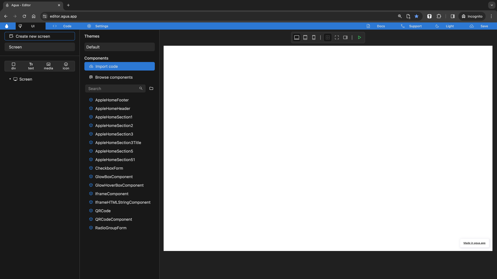

# Setup a project

## Step-by-step

### 1.  Click \[_Open Editor_].



<figure><figcaption></figcaption></figure>

Inside your [dashboard](https://console.agua.app/), you'll be able to create new projects by clicking the \[_Open Editor_] button.&#x20;

You can also access:

* \[[_Documentation_](https://docs.agua.dev/)]
* \[[_Help_](https://wa.me/12396883277)]



### 2. Click \[_**Open folder**_**].**



<figure><figcaption></figcaption></figure>

The \[**Open folder]** button will allow you connect a [local GitHub Repo](https://docs.github.com/en/get-started/quickstart/hello-world) with a new Agua project.\
\
You can also access:

* Our Documentation \[[_Read the docs_](https://docs.agua.dev/)]
* Out Tutorials \[[_Watch our courses_](https://www.youtube.com/@aguafordevs)]
* Our WhatsApp contact \[[_Contact us for support_](https://wa.me/12396883277)]
* Our one-to-one onboarding \[[_Book a call with our founders_](https://agua.tools/meetings/developers/onboarding)]



<figure><figcaption></figcaption></figure>

Once you have created previous projects, the _Recent_ section will allow you to see the title of each one, access it directly.



### 3. Locate your folder.



<figure><figcaption></figcaption></figure>

Your Finder or File Explorer will pop-up and you will be able to select your destiny folder.&#x20;

1. In case you are building a project from scratch, you just need to create a new folder.
2. In case your project is already running, you can select a folder where your previous components and UI assets are located. As seen in the [components section](../../../references/components.md) those components will automatically be imported into Agua and our preview.



### 4. Grant files permission.



<figure><figcaption></figcaption></figure>

Given our Google Chrome integration, you will have to grant your Agua projects access to securely edit your files in the selected folder. For keeping your privacy and the integrity of your files, the access must be renewed each time the project tab is refreshed.



### 5. Access your project.



<figure><figcaption></figcaption></figure>

With your local folder selected, you will be access the [Agua Editor](https://editor.agua.app/). You will be presented with either a blank interfaces, or with the latest edits and components from your running project.



## Need Help?

Contact us directly!

* Email [support@agua.dev](mailto:support@agua.dev).
* Book a [meeting with our founders](https://agua.tools/meetings/developers/onboarding).
* Chat with us on [WhatsApp](https://wa.me/12396883277).

Also,

* Check out our [FAQ](../../../help-and-community/faq.md).


**Help us improve our docs!**

* If there are any topics you'd like us to add to our documentation, please share your feedback in our [Roadmap](https://roadmap.agua.app/).
* Edit this page in our [GitHub Repo](https://github.com/Agua-for-devs/agua-documentation) to fix an error or add an improvement to our documentation in a merge request.

