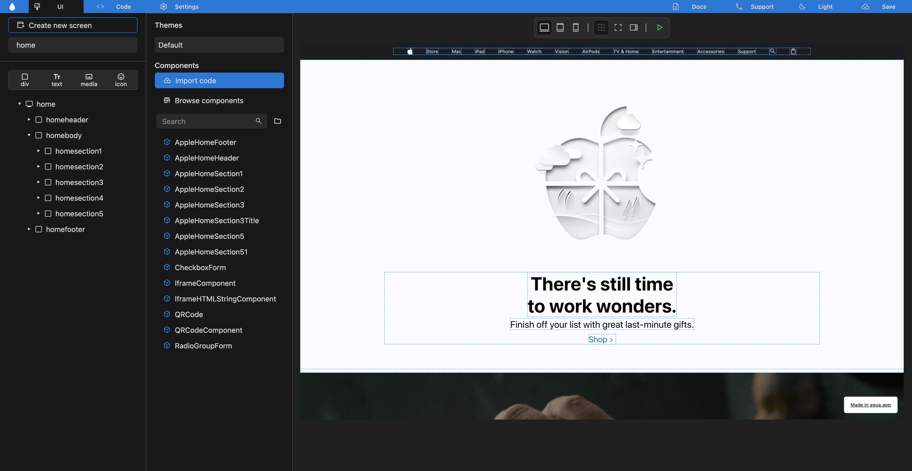
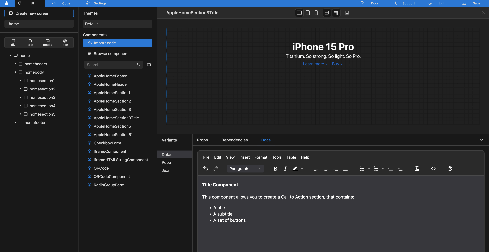

# UI Editor



<figure><figcaption></figcaption></figure>



## [1. Navigation Menu](1.-navigation-menu.md)



<figure><figcaption></figcaption></figure>

1.1. [Dashbord](1.-navigation-menu.md#1.1.-dashbord)

1.2. [UI](1.-navigation-menu.md#1.2.-ui)

1.3. [Code](1.-navigation-menu.md#1.3.-code)

1.4. [Settings](1.-navigation-menu.md#1.4.-settings)

1.5. [Docs](1.-navigation-menu.md#1.5.-docs)

1.6. [Support](1.-navigation-menu.md#1.6.-support)

1.7. [Theme](1.-navigation-menu.md#1.7.-theme)

1.8. [Save](1.-navigation-menu.md#1.8.-save)



## [2. Canva](2.-canva.md)



<figure><figcaption></figcaption></figure>

2.1 [Desktop](2.-canva.md#2.1.-desktop)

2.2 [Tablet](2.-canva.md#2.2.-tablet)

2.3 [Phone](2.-canva.md#2.3.-phone)



## [3. ToolBar](3.-toolbar.md)



<figure><figcaption></figcaption></figure>

3.1. [Views](3.-toolbar.md#3.1.-views)

3.2. [Layout Borders](3.-toolbar.md#3.2.-layout-borders)

3.3. [Full View](3.-toolbar.md#3.3.-full-view)

3.4. [Default SideBar](3.-toolbar.md#3.4.-default-sidebar)

3.5. [Preview](3.-toolbar.md#3.5.-preview)



## [4. Screens Panel](4.-screens-panel.md)



<figure><figcaption></figcaption></figure>

4.1 [Create New Screen](4.-screens-panel.md#4.1.-create-new-screen)

4.2 [Screen Name](4.-screens-panel.md#4.2.-screen-name)



## [5. Elements Tree](5.-elements-tree.md)



<figure><figcaption></figcaption></figure>

5.1. [Elements Bar](5.-elements-tree.md#5.1.-elements-bar)

5.2. [Hierarchy Tree](5.-elements-tree.md#5.2.-hierarchy-tree)



## [6. Properties Panels](6.-properties-panels.md)



<figure><figcaption></figcaption></figure>

6.1. [Basic Properties](6.-properties-panels.md#6.1.-basic-properties)

6.2. [Screen](6.-properties-panels.md#6.2.-screen)

6.3. [Div](6.-properties-panels.md#6.3.-div)

6.4. [Media](6.-properties-panels.md#6.4.-media)

6.5. [Icon](6.-properties-panels.md#6.5.-icon)



## [7. Contextual Panel](7.-contextual-panel.md)



<figure><figcaption></figcaption></figure>

7.1. [Themes](7.-contextual-panel.md#7.1.-themes)

7.2. [Components](7.-contextual-panel.md#7.2.-components)



## [8. Component Preview](8.-component-preview.md)



<figure><figcaption></figcaption></figure>

8.1 [Canva](8.-component-preview.md#8.1-canva)

8.2 [Toolbar](8.-component-preview.md#8.2-toolbar)

8.3 [Props](8.-component-preview.md#8.3-props)

8.4 [Docs](8.-component-preview.md#8.4-docs)



<table data-card-size="large" data-view="cards"><thead><tr><th align="center"></th><th data-hidden data-card-target data-type="content-ref"></th></tr></thead><tbody><tr><td align="center">Learn more about <a href="../../../../references/components.md"><strong>Components</strong></a></td><td><a href="../../../../references/components.md">components.md</a></td></tr><tr><td align="center">Learn more about our <a href="../../../../references/ui-editor/"><strong>UI Editor</strong></a></td><td><a href="../../../../references/ui-editor/">ui-editor</a></td></tr><tr><td align="center">Learn more about our <a href="../../../../references/code-editor.md"><strong>Code Editor</strong></a></td><td><a href="../../../../references/code-editor.md">code-editor.md</a></td></tr><tr><td align="center">Learn more about our <a href="../../../../references/ai-tools.md"><strong>AI Tools</strong></a></td><td><a href="../../../../references/ai-tools.md">ai-tools.md</a></td></tr></tbody></table>

## Need Help?

Contact us directly!

* Email [support@agua.dev](mailto:support@agua.dev).
* Book a [meeting with our founders](https://agua.tools/meetings/developers/onboarding).
* Chat with us on [WhatsApp](https://wa.me/12396883277).

Also,

* Check out our [FAQ](../../../../help-and-community/faq.md).


**Help us improve our docs!**

* If there are any topics you'd like us to add to our documentation, please share your feedback in our [Roadmap](https://roadmap.agua.app/).
* Edit this page in our [GitHub Repo](https://github.com/Agua-for-devs/agua-documentation) to fix an error or add an improvement to our documentation in a merge request.

