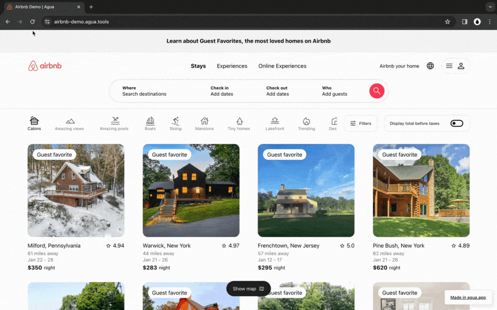

# Tutorial: Creating AirBnb

In this tutorial, you’ll build a the front-end the Airbnb marketplace UI.  You will replicate Airbnbs homepage for a user searching for a cabin in New York. You will create also the main info page of a particular cabin, and a separated page for all its pictures. The interface is built responsive and with a component design approach.&#x20;

## 1. Demo Tour tour.&#x20;



### 1.1 Desktop



<figure><figcaption>
<a href="https://airbnb-demo.agua.tools/Home">https://airbnb-demo.agua.tools/Home</a>
</figcaption></figure>



<figure><figcaption>
<a href="https://airbnb-demo.agua.tools/Stay1">https://airbnb-demo.agua.tools/Stay1</a>
</figcaption></figure>



<figure><figcaption>
<a href="https://airbnb-demo.agua.tools/Stay1photos">https://airbnb-demo.agua.tools/Stay1photos</a>
</figcaption></figure>



<table data-card-size="large" data-view="cards"><thead><tr><th align="center"></th><th data-hidden data-card-target data-type="content-ref"></th></tr></thead><tbody><tr><td align="center"><strong>Fork our GitHub Repo and build it yourself!</strong></td><td><a href="https://github.com/Agua-for-devs/agua-airbnb-demo">https://github.com/Agua-for-devs/agua-airbnb-demo</a></td></tr><tr><td align="center"><strong>Review in Agua the project sample!</strong></td><td><a href="https://github.com/Agua-for-devs/agua-airbnb-demo-deploy">https://github.com/Agua-for-devs/agua-airbnb-demo-deploy</a></td></tr></tbody></table>
