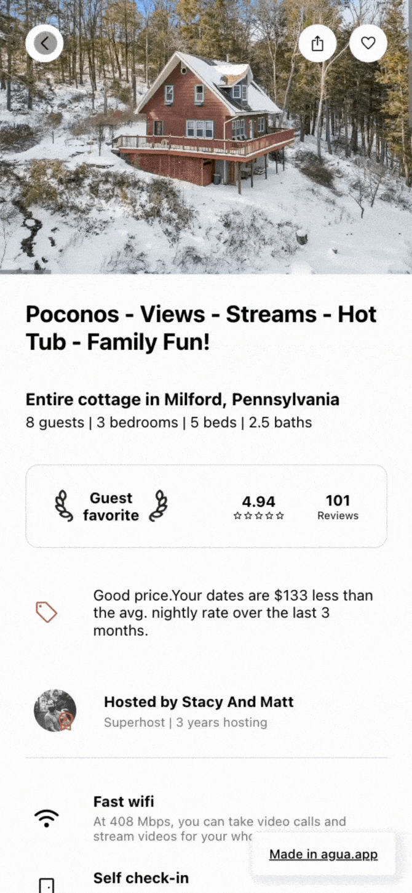

# Tutorial: Creating AirBnb

In this tutorial, **you’ll build the front-end of the** [**Airbnb marketplace UI**](https://www.airbnb.com/)**.**  You will replicate Airbnb's homepage for a user searching for a cabin in New York. You will create also the main info page of a particular cabin, and a separated page for all its photos. The interface is built responsive and uses a component design approach.&#x20;



<table data-card-size="large" data-view="cards"><thead><tr><th align="center"></th><th data-hidden data-card-target data-type="content-ref"></th></tr></thead><tbody><tr><td align="center"><strong>Fork our GitHub Repo and build it yourself!</strong></td><td><a href="https://github.com/Agua-for-devs/agua-airbnb-demo">https://github.com/Agua-for-devs/agua-airbnb-demo</a></td></tr><tr><td align="center"><strong>Review in Agua the project sample!</strong></td><td><a href="https://github.com/Agua-for-devs/agua-airbnb-demo-deploy">https://github.com/Agua-for-devs/agua-airbnb-demo-deploy</a></td></tr></tbody></table>


## You will learn:

### Grid

* [Variant](../../references/ui-editor/properties-panels/basic-properties/style.md#variant)
* [Classes](../../references/ui-editor/properties-panels/basic-properties/style.md#classes)
* [Size Units](../../references/ui-editor/properties-panels/basic-properties/style.md#size-units)
* [Visibility](../../references/ui-editor/properties-panels/basic-properties/style.md#visibility)
* [Cursor](../../references/ui-editor/properties-panels/basic-properties/style.md#cursor)
* [Alignment](../../references/ui-editor/properties-panels/basic-properties/style.md#alignment)
* [Orientation (flex-direction)](../../references/ui-editor/properties-panels/basic-properties/style.md#orientation-flex-direction)
* [Scrollable (overflow)](../../references/ui-editor/properties-panels/basic-properties/style.md#scrollable-overflow)
* [Background](../../references/ui-editor/properties-panels/basic-properties/style.md#background)
* [Padding](../../references/ui-editor/properties-panels/basic-properties/style.md#padding)
*

### Header

* [On click go to](../../references/ui-editor/properties-panels/basic-properties/events.md#on-click-go-to)

### Body

* [Animation](../../references/ui-editor/properties-panels/basic-properties/css.md#animation)
* [Custom CSS](../../references/ui-editor/properties-panels/basic-properties/css.md#custom-css)

### Footer



## 1. Demo Tour

### 1.1. Homepage Tour



<figure><figcaption>
<a href="https://airbnb-demo.agua.tools/Home">https://airbnb-demo.agua.tools/Home</a>
</figcaption></figure>



<figure><figcaption>
<a href="https://airbnb-demo.agua.tools/Stay1">https://airbnb-demo.agua.tools/Stay1</a>
</figcaption></figure>



<figure><figcaption>
<a href="https://airbnb-demo.agua.tools/Stay1photos">https://airbnb-demo.agua.tools/Stay1photos</a>
</figcaption></figure>



### 1.2. Stay Tour



<figure><figcaption>
<a href="https://airbnb-demo.agua.tools/Home">https://airbnb-demo.agua.tools/Home</a>
</figcaption></figure>



<figure><figcaption>
<a href="https://airbnb-demo.agua.tools/Stay1">https://airbnb-demo.agua.tools/Stay1</a>
</figcaption></figure>



<figure><figcaption>
<a href="https://airbnb-demo.agua.tools/Stay1photos">https://airbnb-demo.agua.tools/Stay1photos</a>
</figcaption></figure>



### 1.3. Stay's photo Tour



<figure><figcaption>
<a href="https://airbnb-demo.agua.tools/Home">https://airbnb-demo.agua.tools/Home</a>
</figcaption></figure>



<figure><figcaption>
<a href="https://airbnb-demo.agua.tools/Stay1">https://airbnb-demo.agua.tools/Stay1</a>
</figcaption></figure>



<figure><figcaption>
<a href="https://airbnb-demo.agua.tools/Stay1photos">https://airbnb-demo.agua.tools/Stay1photos</a>
</figcaption></figure>



