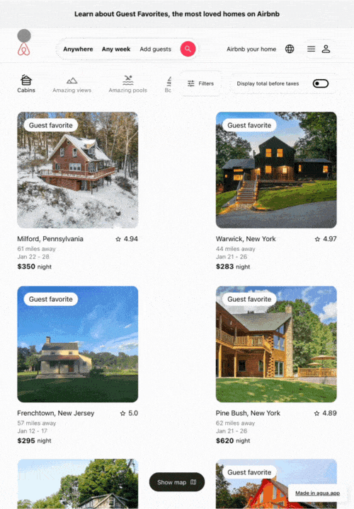
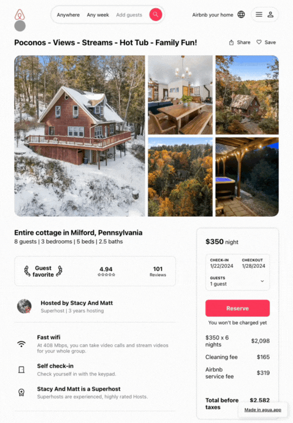

# Tutorial: Creating AirBnb

In this tutorial, **you’ll build the front-end of the** [**Airbnb marketplace UI**](https://www.airbnb.com/)**.**  You will replicate Airbnb's homepage for a user searching for a cabin in New York. You will create also the main info page of a particular cabin, and a separated page for all its photos. The interface is built responsive and uses a component design approach. 

## 1. Demo Tour 



### 1.1. Homepage Tour



<figure><figcaption>
<a href="https://airbnb-demo.agua.tools/Home">https://airbnb-demo.agua.tools/Home</a>
</figcaption></figure>



<figure><figcaption>
<a href="https://airbnb-demo.agua.tools/Stay1">https://airbnb-demo.agua.tools/Stay1</a>
</figcaption></figure>



<figure><figcaption>
<a href="https://airbnb-demo.agua.tools/Stay1photos">https://airbnb-demo.agua.tools/Stay1photos</a>
</figcaption></figure>



### 1.2. Stay Tour



<figure><figcaption>
<a href="https://airbnb-demo.agua.tools/Home">https://airbnb-demo.agua.tools/Home</a>
</figcaption></figure>



<figure><figcaption>
<a href="https://airbnb-demo.agua.tools/Stay1">https://airbnb-demo.agua.tools/Stay1</a>
</figcaption></figure>



<figure><figcaption>
<a href="https://airbnb-demo.agua.tools/Stay1photos">https://airbnb-demo.agua.tools/Stay1photos</a>
</figcaption></figure>



### 1.3. Stay's photo Tour



<figure><figcaption>
<a href="https://airbnb-demo.agua.tools/Home">https://airbnb-demo.agua.tools/Home</a>
</figcaption></figure>



<figure><figcaption>
<a href="https://airbnb-demo.agua.tools/Stay1">https://airbnb-demo.agua.tools/Stay1</a>
</figcaption></figure>



<figure><figcaption>
<a href="https://airbnb-demo.agua.tools/Stay1photos">https://airbnb-demo.agua.tools/Stay1photos</a>
</figcaption></figure>



<table data-card-size="large" data-view="cards"><thead><tr><th align="center"></th><th data-hidden data-card-target data-type="content-ref"></th></tr></thead><tbody><tr><td align="center"><strong>Fork our GitHub Repo and build it yourself!</strong></td><td><a href="https://github.com/Agua-for-devs/agua-airbnb-demo">https://github.com/Agua-for-devs/agua-airbnb-demo</a></td></tr><tr><td align="center"><strong>Review in Agua the project sample!</strong></td><td><a href="https://github.com/Agua-for-devs/agua-airbnb-demo-deploy">https://github.com/Agua-for-devs/agua-airbnb-demo-deploy</a></td></tr></tbody></table>
