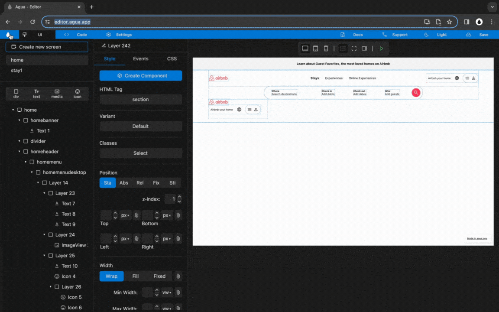
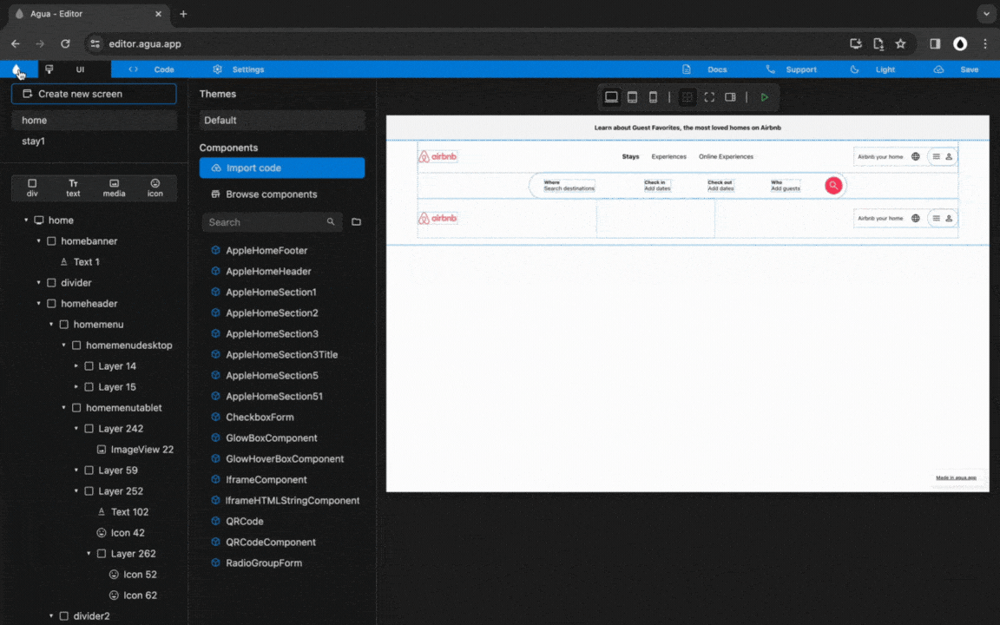
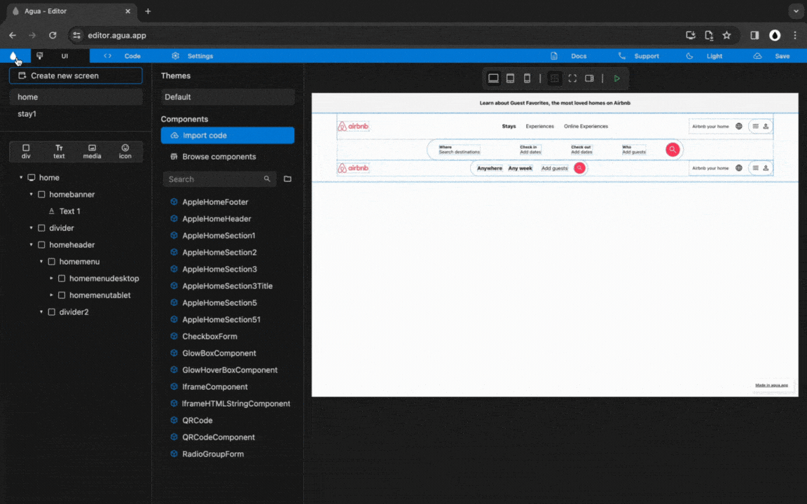
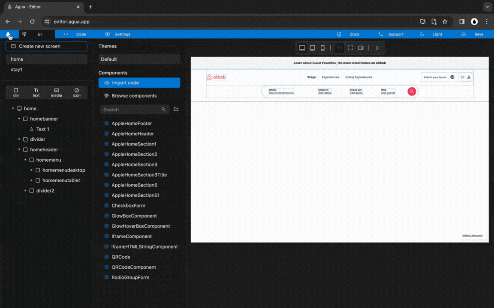
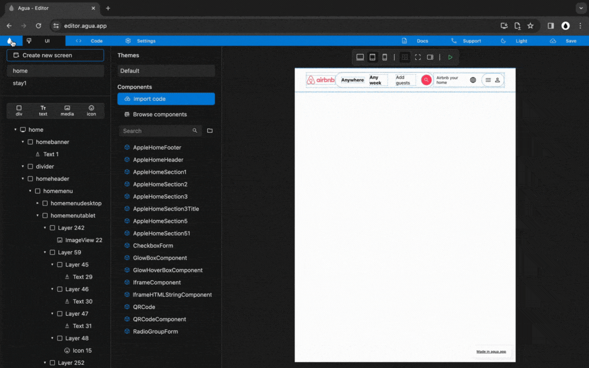

# 3.2 Tablet Menu



<figure><figcaption></figcaption></figure>



***



<figure><figcaption></figcaption></figure>



***



<figure><figcaption></figcaption></figure>



***



<figure><figcaption></figcaption></figure>



***



<figure><figcaption></figcaption></figure>



<figure><figcaption></figcaption></figure>



***



<figure><figcaption></figcaption></figure>



***



<figure><figcaption></figcaption></figure>



***
