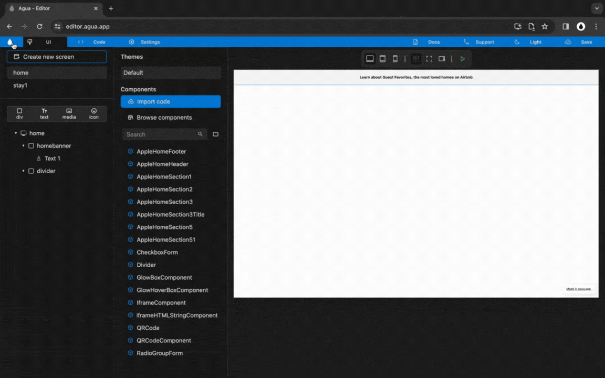

# 4. Home: Header

## Structure and Style




**You will create a Div element:**




<figure><figcaption>
Pending to Update.
</figcaption></figure>







### **1.1.** New _Div_:

> **Name:** `homeheader`

1<strong>.1. Written steps</strong>

#### -Inside the _**Element Tree**_-

#### **A. \[Click]** **the **_**Div Icon**_**:**

* The button is located at the top of the panel, below the _Screens._
* The _Icon_ will turn blue, and your pointer will change.

#### **B. Drag your pointer and click "Home":**

* The new element will appear as a child of the _Screen_.

<!---->

* The _Div_ will be created with the default name "Layer #".

#### -Inside the **Properties Panel**-

#### **C. \[Click] the current name of the **_**Div**_** and \[type] the new one**:

* The new name should be lowercase, without any spaces or special characters.

<!---->

* The name will be updated in the _Element Tree_ after you have \[clicked] away.

### **1.2.** New child _Divs,_ inside _"_homeheader":

> **Name 1:** `homebanner`
>
> **Name 2:** `horizontaldivider`
>
> **Name 3:** `homemenu`
>
> **Name 4:** `homenavbar`

1<strong>.2. Written steps</strong>

#### -Inside the _**Element Tree**_-

#### **A. \[Click]** **the **_**Div Icon**_**:**

* The button is located at the top of the panel, below the _Screens._
* The _Icon_ will turn blue, and your pointer will change.

#### **B. Drag your pointer and click "**homeheader**":**

* The new element will appear as a child of the _Screen_.

<!---->

* The _Div_ will be created with the default name "Layer #".

#### -Inside the **Properties Panel**-

#### **C. \[Click] the current name of the **_**Div**_** and \[type] the new one**:

* The new name should be lowercase, without any spaces or special characters.

<!---->

* The name will be updated in the _Element Tree_ after you have \[clicked] away.

### **1.3.** Set "homeheader" _Size_:

> **Width**_:_ `Fill`
>
> **Height**: `Wrap`

<strong>1.3. Written steps</strong>

#### -Inside the **Properties Panel**-

#### **A. \[Click]** **the **_**Fill**_** button,** inside the Width section_:_

* The horizontal size of the Div will be the 100% _of the screen._
* You cannot use a _Fill size_ in the case there is a parent element with a _Wrap size._

#### **B. \[Click]** **the **_**Wrap**_** button,** inside the Height section_:_

* The vertical size of the Div will become its child's maximum combined size.
* You cannot use a _Wrap size_ in the case there is a child element with a _fill size_.



