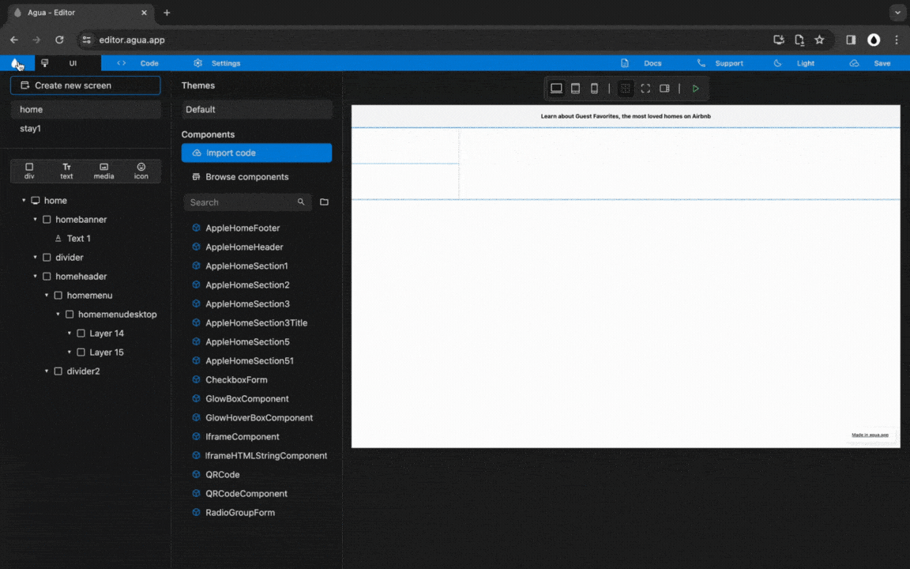
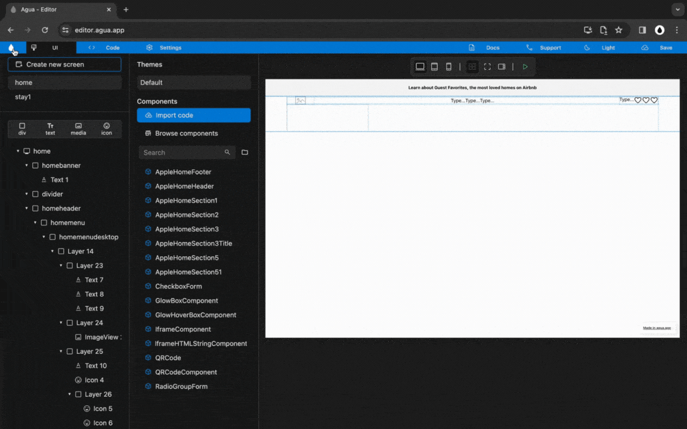

# 5. Header | Desktop Menu

## Structure

### Step 1




**You will:**




<figure><figcaption>
Pending to Update.
</figcaption></figure>







### **1.1.** New child _Div,_ inside _"_homemenu":

> **Name:** `homemenudesktop`

1<strong>.1. Written steps</strong>

#### -Inside the _**Element Tree**_-

#### **A. \[Click]** **the **_**Div Icon**_**:**

* The button is located at the top of the panel, below the _Screens._
* The _Icon_ will turn blue, and your pointer will change.

#### **B. Drag your pointer and click "**homemenu**":**

* The new element will appear as a child of the _Screen_.
* The _Div_ will be created with the default name "Layer #".

#### -Inside the **Properties Panel**-

#### **C. \[Click] the current name of the **_**Div**_** and \[type] the new one**:

* The new name should be lowercase, without any spaces or special characters.
* The name will be updated in the _Element Tree_ after you have \[clicked] away.

### **1.2.** New child _Divs,_ inside _"_homemenudesktop":

> **Name 1 :** `sitemenu`
>
> **Name 2:** `searchmenu`

1<strong>.2. Written steps</strong>

#### -Inside the _**Element Tree**_-

#### **A. \[Click]** **the **_**Div Icon**_**:**

* The button is located at the top of the panel, below the _Screens._
* The _Icon_ will turn blue, and your pointer will change.

#### **B. Drag your pointer and click "**homemenudesktop**":**

* The new element will appear as a child of the _Screen_.
* The _Div_ will be created with the default name "Layer #".

#### -Inside the **Properties Panel**-

#### **C. \[Click] the current name of the **_**Div**_** and \[type] the new one**:

* The new name should be lowercase, without any spaces or special characters.
* The name will be updated in the _Element Tree_ after you have \[clicked] away.

### **1.3.** Set "homemenudesktop" _Size_:

> **Width**_:_ `Fill`
>
> **Height**: `Wrap`

1<strong>.3. Written steps</strong>

#### -Inside the **Properties Panel**-

#### **A. \[Click]** **the **_**Fill**_** button,** inside the Width section_:_

* The horizontal size of the Div will be the 100% _of the screen._
* You cannot use _Fill size_ in the case there is a parent element in _Wrap size._

#### **B. \[Click]** **the **_**Wrap**_** button,** inside the Height section_:_

* The vertical size of the Div will become its child's maximum combined size.
* You cannot use _Wrap size_ in the case there is a child element in _Fill size_.




## Site Menu: Elements

### Step 2




**You will:**




<figure><figcaption></figcaption></figure>







### **2.1.**New child _Divs,_ inside _"_sitemenu":

> **Name 1:** `sitemenumap`
>
> **Name 2:** `sitemenulogo`
>
> **Name 3:** `sitemenuusers`

2<strong>.1. Written steps</strong>

#### -Inside the _**Element Tree**_-

#### **A. \[Click]** **the **_**Div Icon**_**:**

* The button is located at the top of the panel, below the _Screens._
* The _Icon_ will turn blue, and your pointer will change.

#### **B. Drag your pointer and click "**homemenudesktop**":**

* The new element will appear as a child of the _Screen_.
* The _Div_ will be created with the default name "Layer #".

#### -Inside the **Properties Panel**-

#### **C. \[Click] the current name of the **_**Div**_** and \[type] the new one**:

* The new name should be lowercase, without any spaces or special characters.
* The name will be updated in the _Element Tree_ after you have \[clicked] away.

### **2.2.** Set "sitemenu" _Size_:

> **Width**_:_ `Fill`
>
> **Height**: `Wrap`

2<strong>.2. Written steps</strong>

#### -Inside the **Properties Panel**-

#### **A. \[Click]** **the **_**Fill**_** button,** inside the Width section_:_

* The horizontal size of the Div will be the 100% _of the screen._
* You cannot use _Fill size_ in the case there is a parent element in _Wrap size._

#### **B. \[Click]** **the **_**Wrap**_** button,** inside the Height section_:_

* The vertical size of the Div will become its child's maximum combined size.
* You cannot use _Wrap size_ in the case there is a child element in _Fill size_.

### 2.3. Set "sitemenu" _Alignment_:

> **Main:** `Axis center`
>
> **Cross:** `Axis distribute`

2<strong>.3. Written steps</strong>

#### -Inside the **Properties Panel**-

#### **A. \[Click]** **the **_**Main** Axis center_ **button,** inside the Alignment section:

* In the Top-Down first row of buttons, choose the Left-to-right second one.
* The items are packed to each other toward the center.

#### **B. \[Click]** **the **_**Cross** Axis distribute_ **button,** inside the Alignment section:

* In the Top-Down second row of buttons, choose the Left-to-right fourth one.
* The items are distributed with the first and last one flushed to the edges.

### **2.4.** Set "sitemenu" _Orientation_:

> `Horizontal`

2<strong>.4. Written steps</strong>

#### -Inside the **Properties Panel**-

#### **\[Click]** **the **_**Horizontal**_** button,** inside the Orientation section_:_

* Will set the Div's flex-direction to row.
* Will maintain Div's Main and Cross axis Alignment.




### Step 3




**You will:**




<figure><figcaption></figcaption></figure>







### **3.1.** New child _Texts,_ inside _"_sitemenumap":

> **Name 1:** `sitemenutext1`
>
> **Name 2:** `sitemenutext2`
>
> **Name 3:** `sitemenutext3`

3<strong>.1. Written steps</strong>

#### -Inside the _**Element Tree**_-

#### **A. \[Click]** **the **_**Text Icon**_**:**

* The button is located at the top of the panel, below the _Screens._
* The _Icon_ will turn blue, and your pointer will change.

#### **B. Drag your pointer and click "**sitemenumap**":**

* The new element will appear as a child of the _Screen_.
* The _Text_ will be created with the default name "Text #".

#### -Inside the **Properties Panel**-

#### **C. \[Click] the current name of the **_**Text**_** and \[type] the new one**:

* The new name should be lowercase, without any spaces or special characters.
* The name will be updated in the _Element Tree_ after you have \[clicked] away.

### **3.2.** New child _Media,_ inside _"_sitemenulogo":

> **Name:** `sitemenumedia1`

3<strong>.2. Written steps</strong>

#### -Inside the _**Element Tree**_-

#### **A. \[Click]** **the **_**Media Icon**_**:**

* The button is located at the top of the panel, below the _Screens._
* The _Icon_ will turn blue, and your pointer will change.

#### **B. Drag your pointer and click "**sitemenulogo**":**

* The new element will appear as a child of the _Screen_.
* The _Media_ will be created with the default name "Image #".

#### -Inside the **Properties Panel**-

#### **C. \[Click] the current name of the **_**Media**_** and \[type] the new one**:

* The new name should be lowercase, without any spaces or special characters.
* The name will be updated in the _Element Tree_ after you have \[clicked] away.

### **3.3.** New child _Text,_ inside _"_sitemenuusers"_:_

> **Name:** `sitemenutext4`

3<strong>.3. Written steps</strong>

#### -Inside the _**Element Tree**_-

#### **A. \[Click]** **the **_**Text Icon**_**:**

* The button is located at the top of the panel, below the _Screens._
* The _Icon_ will turn blue, and your pointer will change.

#### **B. Drag your pointer and click "**sitemenuusers**":**

* The new element will appear as a child of the _Screen_.
* The _Text_ will be created with the default name "Text #".

#### -Inside the **Properties Panel**-

#### **C. \[Click] the current name of the **_**Text**_** and \[type] the new one**:

* The new name should be lowercase, without any spaces or special characters.
* The name will be updated in the _Element Tree_ after you have \[clicked] away.

### **3.4.** New child _Icon,_ inside _"_sitemenuusers"_:_

> **Name:** `sitemenuicon1`

3<strong>.4. Written steps</strong>

#### -Inside the _**Element Tree**_-

#### **A. \[Click]** **the **_**Icon Icon**_**:**

* The button is located at the top of the panel, below the _Screens._
* The _Icon_ will turn blue, and your pointer will change.

#### **B. Drag your pointer and click "**sitemenuusers**":**

* The new element will appear as a child of the _Screen_.
* The _Icon_ will be created with the default name "Icon #".

#### -Inside the **Properties Panel**-

#### **C. \[Click] the current name of the **_**Icon**_** and \[type] the new one**:

* The new name should be lowercase, without any spaces or special characters.
* The name will be updated in the _Element Tree_ after you have \[clicked] away.

### **3.5.** New child _Div,_ inside _"_sitemenuusers"_:_

> **Name:** `sitemenudiv1`

3<strong>.5. Written steps</strong>

#### -Inside the _**Element Tree**_-

#### **A. \[Click]** **the **_**Div Icon**_**:**

* The button is located at the top of the panel, below the _Screens._
* The _Icon_ will turn blue, and your pointer will change.

#### **B. Drag your pointer and click "**sitemenuusers**":**

* The new element will appear as a child of the _Screen_.
* The _Div_ will be created with the default name "Layer #".

#### -Inside the **Properties Panel**-

#### **C. \[Click] the current name of the **_**Div**_** and \[type] the new one**:

* The new name should be lowercase, without any spaces or special characters.
* The name will be updated in the _Element Tree_ after you have \[clicked] away.

### **3.6.** New child _Icons,_ inside _"_sitemenudiv1":

> **Name 1:** `sitemenuicon2`
>
> **Name 2:** `sitemenuicon3`

3<strong>.6. Written steps</strong>

#### -Inside the _**Element Tree**_-

#### **A. \[Click]** **the **_**Icon Icon**_**:**

* The button is located at the top of the panel, below the _Screens._
* The _Icon_ will turn blue, and your pointer will change.

#### **B. Drag your pointer and click "**sitemenudiv1**":**

* The new element will appear as a child of the _Screen_.
* The _Icon_ will be created with the default name "Icon #".

#### -Inside the **Properties Panel**-

#### **C. \[Click] the current name of the **_**Icon**_** and \[type] the new one**:

* The new name should be lowercase, without any spaces or special characters.
* The name will be updated in the _Element Tree_ after you have \[clicked] away.




### Step 4




**You will:**




<figure><figcaption></figcaption></figure>







### **4.1.** Set "sitemenumap" _Size_:

> **Width**_:_ `Fill`
>
> **Height**: `Fill`

4<strong>.1. Written steps</strong>

\-Inside the **Properties Panel**-

#### **A. \[Click]** **the **_**Fill**_** button,** inside the Width section_:_

* The horizontal size of the Div will be the 100% _of the screen._
* You cannot use _Fill size_ in the case there is a parent element in _Wrap size._

#### **B. \[Click]** **the **_**Fill**_** button,** inside the **Height** section_:_

* The vertical size of the Div will be the 100% _of the screen._
* You cannot use _Fill size_ in the case there is a parent element in _Wrap size._

### 4.2. Set "sitemenu" _Alignment_:

> **Main:** `Axis center`
>
> **Cross:** `Axis center`

4<strong>.2. Written steps</strong>

#### -Inside the **Properties Panel**-

#### **A. \[Click]** **the **_**Main** Axis center_ **button,** inside the Alignment section_:_

* In the Top-Down first row of buttons, choose the Left-to-right second one.
* The items are packed to each other toward the center.

#### **B. \[Click]** **the **_**Cross** Axis center_ **button,** inside the Alignment section_:_

* In the Top-Down second row of buttons, choose the Left-to-right second one.
* The items are packed to each other toward the center.

### **4.3.** Set "sitemenulogo, sitemenuusers, and sitemenudiv1" _Size_:

> **Width**_:_ `Wrap`
>
> **Height**: `Wrap`

4<strong>.3. Written steps</strong>

#### -Inside the **Properties Panel**-

#### **A. \[Click]** **the **_**Wrap**_** button,** inside the Width section_:_

* The horizontal size of the Div will become its child's maximum combined size.
* You cannot use _Wrap size_ in the case there is a child element in _Fill size_.

#### **B. \[Click]** **the **_**Wrap**_** button,** inside the Height section_:_

* The vertical size of the Div will become its child's maximum combined size.
* You cannot use _Wrap size_ in the case there is a child element in _Fill size_.

### **4.3.** Set "sitemenu, sitemenumap, and sitemenuusers" _Orientation_:

> `Horizontal`

4<strong>.4. Written steps</strong>

#### -Inside the **Properties Panel**-

#### **\[Click]** **the **_**Horizontal**_** button,** inside the Orientation section_:_

* Set the Div's flex-direction to row.
* Maintain Div's Main and Cross axis Alignment.




## Site Menu: Position

### Steps 5




**You will:**




<figure><figcaption></figcaption></figure>







### **5.1.** Set "sitemenu" _Position_:

> `Relative`

5<strong>.1. Written steps</strong>

#### -Inside the **Properties Panel**-

#### **\[Click]** **the **_**Rel**_** button,** inside the Position section_:_

* In the row of buttons, choose the left-to-right third one.
* The Div is offset relative to itself with a new stacking context.
* Its child elements are positioned relative to the parent.

### **5.2.** Set "sitemenumap" _Position_:

> `Absolute`

5<strong>.2. Written steps</strong>

#### -Inside the **Properties Panel**-

#### **\[Click]** **the **_**Abs**_** button,** inside the Position section_:_

* In the row of buttons, choose the left-to-right second one.
* The Div's final position is determined by the values of top, right, bottom, and left.
* It is  positioned relative to its closest positioned ancestor or initial containing block.

### **5.3.** Set "sitemenulogo, and sitemenuusers" _z-index_:

> `1`

5<strong>.3. Written steps</strong>

#### -Inside the **Properties Panel**-

#### \[Click] the _z-index_ container and **\[type]** **the new value**_:_

* You can also change the size value using the _up and down arrows._
* You can only use positive values.
* It changes the default auto value into a particular stack level.




### Steps 6




**You will:**




<figure><figcaption></figcaption></figure>







### 6.1. Set "homemenu" _Padding_:

> **Left:** `80 px`
>
> **Right:** `80 px`

6<strong>.1. Written steps</strong>

#### -Inside the **Properties Panel**-

#### **A.** \[Click] the _Padding Left_ container and **\[type]** **the new value**_:_

* You can also change the size value using the _up and down arrows._
* The default _Unit_ is in _Pixels_, you do not need to change it.

#### **B.** \[Click] the _Padding Right_ container and **\[type]** **the new value**_:_

* You can also change the size value using the _up and down arrows._
* The default _Unit_ is in _Pixels_, you do not need to change it.

### **6.2.** Set "sitemenumedia1" _Size_:

> **Width**_:_ `100 px`
>
> **Height**: `30 px`

6<strong>.2. Written steps</strong>

#### -Inside the **Properties Panel**-

#### **A.**  \[Click] the _Width size_ container and **\[type]** **the new value**_:_

* You can also change the size value using the _up and down arrows._
* The default _Size_ of a new Div is Fixed, you do not need to change it.
* The default _Unit_ of _Fixed_ size is _Pixels_, you do not need to change it.

#### **B.**  \[Click] the _Height size_ container and **\[type]** **the new value**_:_

* You can also change the size value using the _up and down arrows._
* The default _Size_ of a new Div is Fixed, you do not need to change it.
* The default _Unit_ of _Fixed_ size is _Pixels_, you do not need to change it.




## Site Menu: Media

### Step 7




**You will:**




<figure><figcaption></figcaption></figure>







### 7.1. Set "sitemenumedia1" _Image Source_:

> `Assets/Brand/Airbnb_logo.png`

7<strong>.1. Written steps</strong>

#### -Inside the **Properties Panel**-

#### \[Click] the _Image Source_ dropdown and \[click] the FilePath:

* The following media formats are allowed: JPG, JPEG, PNG and GIF.
* All the files need to be within the main projects folder.
* Files can be located in different subfolders.

### 7.2. Set "sitemenutext1" _Text_:

> `Stays`

7<strong>.2. Written steps</strong>

#### -Inside the **Properties Panel**-

#### **\[Click]** **the Text container and \[type]:**

* You will have to erase the default text: _Type..._
* You can also copy and paste text from other sources.
* You can use any type of characters.
* You cannot create a line break with the \[enter] key.
* You can create line breaks by adjusting the _Text Width_.

### 7.3. Set "sitemenutext2" _Text_:

> `Experiences`

7<strong>.3. Written steps</strong>

#### -Inside the **Properties Panel**-

#### **\[Click]** **the Text container and \[type]:**

* You will have to erase the default text: _Type..._
* You can also copy and paste text from other sources.
* You can use any type of characters.
* You cannot create a line break with the \[enter] key.
* You can create line breaks by adjusting the _Text Width_.

### 7.4. Set "sitemenutext3" _Text_:

> `Online Experiences`

7<strong>.4. Written steps</strong>

#### -Inside the **Properties Panel**-

#### **\[Click]** **the Text container and \[type]:**

* You will have to erase the default text: _Type..._
* You can also copy and paste text from other sources.
* You can use any type of characters.
* You cannot create a line break with the \[enter] key.
* You can create line breaks by adjusting the _Text Width_.

### 7.5. Set "sitemenutext4" _Text_:

> `Airbnb your home`

7<strong>.5. Written steps</strong>

#### -Inside the **Properties Panel**-

#### **\[Click]** **the Text container and \[type]:**

* You will have to erase the default text: _Type..._
* You can also copy and paste text from other sources.
* You can use any type of characters.
* You cannot create a line break with the \[enter] key.
* You can create line breaks by adjusting the _Text Width_.

### 7.6. Set "sitemenuicon1" _Icon_:

> `language`

7<strong>.6. Written steps</strong>

#### -Inside the **Properties Panel**-

#### \[Click] the _Image Source_ dropdown and \[click] the _Icon_:

* You can use the _Icon_ name to find it through the SearchBar.
* You can also find it through each Material category's dropdown.

### 7.7. Set "sitemenuicon2" _Icon_:

> `menu`

7<strong>.7. Written steps</strong>

#### -Inside the **Properties Panel**-

#### \[Click] the _Image Source_ dropdown and \[click] the _Icon_:

* You can use the _Icon_ name to find it through the SearchBar.
* You can also find it through each Material category's dropdown.

### 7.8. Set "sitemenuicon3" _Icon_:

> `person_outline`

7<strong>.8. Written steps</strong>

#### -Inside the **Properties Panel**-

#### \[Click] the _Image Source_ dropdown and \[click] the _Icon_:

* You can use the _Icon_ name to find it through the SearchBar.
* You can also find it through each Material category's dropdown.




## Site Menu: Style

### Step 8




**You will:**




<figure><figcaption></figcaption></figure>







### 8.1. Set "homemenu" _Padding_:

> **Top:** `18 px`
>
> **Bottom:** `18 px`
>
> **Left:** `80 px`
>
> **Right:** `80 px`

8<strong>.1. Written steps</strong>

#### -Inside the **Properties Panel**-

#### **A.** \[Click] the _Padding Top_ container and **\[type]** **the new value**_:_

* You can also change the size value using the _up and down arrows._
* The default _Unit_ is in _Pixels_, you do not need to change it.

#### **B.** \[Click] the _Padding Bottom_ container and **\[type]** **the new value**_:_

* You can also change the size value using the _up and down arrows._
* The default _Unit_ is in _Pixels_, you do not need to change it.

#### **C.** \[Click] the _Padding Left_ container and **\[type]** **the new value**_:_

* You can also change the size value using the _up and down arrows._
* The default _Unit_ is in _Pixels_, you do not need to change it.

#### **D.** \[Click] the _Padding Right_ container and **\[type]** **the new value**_:_

* You can also change the size value using the _up and down arrows._
* The default _Unit_ is in _Pixels_, you do not need to change it.

### 8.2. Set "sitemenutext1, sitemenutext2 and sitemenutext3" _Margin_:

> **Left:** `16 px`
>
> **Right:** `16 px`

8<strong>.2. Written steps</strong>

#### -Inside the **Properties Panel**-

#### **A.** \[Click] the _Margin Left_ container and **\[type]** **the new value**_:_

* You can also change the size value using the _up and down arrows._
* The default _Unit_ is in _Pixels_, you do not need to change it.

#### **B.** \[Click] the _Margin Right_ container and **\[type]** **the new value**_:_

* You can also change the size value using the _up and down arrows._
* The default _Unit_ is in _Pixels_, you do not need to change it.




### Step 9




**You will:**




<figure><figcaption></figcaption></figure>







### 9.1. Set "sitemenudiv1" _Border Color_:

> `E0E0E0`

9<strong>.1. Written steps</strong>

#### -Inside the **Properties Panel**-

#### **A. \[Click]** **the **_**Background**_** toggle and \[click] **_**Fill**:_

* Fill allows you to select either a material color or a gradient as background.

**B. \[Click] **_**Background color**_** and** **\[Type]** **the desired color**_:_

* You can type a 6 characters HEX code without the initial #.

### 9.2. Set "sitemenudiv1" _Border Width_:

> `1`

9<strong>.2. Written steps</strong>

#### -Inside the **Properties Panel**-

#### \[Click] the _Width_ container, inside the Borders section, and **\[type]** **the new value**_:_

* The _Border Width_ applies to all four sides of a _Div._
* You can also change the size value using the _up and down arrows._
* The default _Unit_ is in _Pixels._

### 9.3. Set "sitemenudiv1" _Radius_:

> `25`

9<strong>.3. Written steps</strong>

#### -Inside the **Properties Panel**-

#### \[Click] the _Radius_ container, inside the Borders section, and **\[type]** **the new value**_:_

* The _Radius_ applies to all four sides of a _Div._
* You can also change the size value using the _up and down arrows._
* The default _Unit_ is in _Pixels._

### 9.4. Set "sitemenudiv1" _Padding_:

> **Top:** `10`
>
> **Bottom:** `10`

9<strong>.4. Written steps</strong>

#### -Inside the **Properties Panel**-

#### **A.** \[Click] the _Padding Top_ container and **\[type]** **the new value**_:_

* You can also change the size value using the _up and down arrows._
* The default _Unit_ is in _Pixels_, you do not need to change it.

#### **B.** \[Click] the _Padding Bottom_ container and **\[type]** **the new value**_:_

* You can also change the size value using the _up and down arrows._
* The default _Unit_ is in _Pixels_, you do not need to change it.

### 9.5. Set "sitemenudiv1" _Margin_:

> **Left:** `8`

9<strong>.5. Written steps</strong>

#### -Inside the **Properties Panel**-

#### \[Click] the _Margin Left_ container and **\[type]** **the new value**_:_

* You can also change the size value using the _up and down arrows._
* The default _Unit_ is in _Pixels_, you do not need to change it.

### 9.6. Set "sitemenuicon2" _Margin_:

> **Left:** `10`
>
> **Right:** `4`

9<strong>.6. Written steps</strong>

#### -Inside the **Properties Panel**-

#### **A.** \[Click] the _Margin Left_ container and **\[type]** **the new value**_:_

* You can also change the size value using the _up and down arrows._
* The default _Unit_ is in _Pixels_, you do not need to change it.

#### **B.** \[Click] the _Margin Right_ container and **\[type]** **the new value**_:_

* You can also change the size value using the _up and down arrows._
* The default _Unit_ is in _Pixels_, you do not need to change it.

### 9.7. Set "sitemenuicon3" _Margin_:

> **Left:** `4`
>
> **Right:** `10`

9<strong>.7. Written steps</strong>

#### -Inside the **Properties Panel**-

#### **A.** \[Click] the _Margin Left_ container and **\[type]** **the new value**_:_

* You can also change the size value using the _up and down arrows._
* The default _Unit_ is in _Pixels_, you do not need to change it.

#### **B.** \[Click] the _Margin Right_ container and **\[type]** **the new value**_:_

* You can also change the size value using the _up and down arrows._
* The default _Unit_ is in _Pixels_, you do not need to change it.




### Step 10




**You will:**




<figure><figcaption></figcaption></figure>







### 10.1. Set "sitemenutext4, sitemenuicon1" _Margin_:

> **Left:** `10`
>
> **Right:** `10`

10<strong>.1. Written steps</strong>

#### -Inside the **Properties Panel**-

#### **A.** \[Click] the _Margin Left_ container and **\[type]** **the new value**_:_

* You can also change the size value using the _up and down arrows._
* The default _Unit_ is in _Pixels_, you do not need to change it.

#### **B.** \[Click] the _Margin Right_ container and **\[type]** **the new value**_:_

* You can also change the size value using the _up and down arrows._
* The default _Unit_ is in _Pixels_, you do not need to change it.

### 10.2. Set "sitemenutext4" _Font Size_:

> `14`

10<strong>.2. Written steps</strong>

#### -Inside the **Properties Panel**-

#### \[Click] the _Font Size_ container and **\[type]** **the new value**_:_

* You can also change the size value using the _up and down arrows._

### 10.3. Set "sitemenuicon1, sitemenuicon2, sitemenuicon3" _Icon Size_:

> `24`

10<strong>.3 Written steps</strong>

#### -Inside the **Properties Panel**-

#### \[Click] the _Icon Size_ container and **\[type]** **the new value**_:_

* You can also change the size value using the _up and down arrows._




### Step 11




**You will:**




<figure><figcaption></figcaption></figure>







### 11.1. Set "menuusers" _Alignment_:

> **Main:** `Axis center`
>
> **Cross:** `Axis center`

11<strong>.1. Written steps</strong>

#### -Inside the **Properties Panel**-

#### **A. \[Click]** **the **_**Main** Axis center_ **button,** inside the Alignment section_:_

* In the Top-Down first row of buttons, choose the Left-to-right second one.
* The items are packed to each other toward the center.

#### **B. \[Click]** **the **_**Cross** Axis center_ **button,** inside the Alignment section_:_

* In the Top-Down second row of buttons, choose the Left-to-right second one.
* The items are packed to each other toward the center.

### 11.2. Set "sitemenutext1, sitemenutext2, sitemenutext3" _Font Size_:

> `16`

11<strong>.2. Written steps</strong>

#### -Inside the **Properties Panel**-

#### \[Click] the _Font Size_ container and **\[type]** **the new value**_:_

* You can also change the size value using the _up and down arrows._

### 11.3. Set "sitemenutext1" _Font Style_:

> `[B] Bold`

11<strong>.3. Written steps</strong>

#### -Inside the **Properties Panel**-

#### **\[Click]** **the** _B_ **button,** inside the Font Style section:

* You can only select  Bold, Italic or Normal, one at the time.
* If changed before, the Bold toggle needs to be set to neutral and then back to Bold.




## Search Menu: Elements

### Step 12




**You will:**




<figure><figcaption></figcaption></figure>







### **12.1.** New child _Divs,_ inside _"_searchmenu":

> **Name 1 :** `searchmenudiv1`
>
> **Name 2 :** `searchmenudiv2`
>
> **Name 3 :** `searchmenudiv3`
>
> **Name 4 :** `searchmenudiv4`
>
> **Name 5 :** `searchmenudiv5`

12<strong>.1. Written steps</strong>

### **12.2.** Set "sitemenumedia1" _Size_:

> **Width**_:_ `Wrap`
>
> **Height**: `Wrap`

12<strong>.2. Written steps</strong>

### 12.3. Set "searchmenu" _Orientation_:

> `Horizontal`

12<strong>.3. Written steps</strong>

### 12.4. Set "searchmenu" _Padding_:

> **Top:** `10`
>
> **Bottom:** `10`
>
> **Left:** `10`
>
> **Right:** `10`

12<strong>.4. Written steps</strong>




### Step 13




**You will:**




<figure><figcaption></figcaption></figure>







### **13.1.** New child _Texts,_ inside _"_searchmenudiv1":

> **Name 1 :** `searchmenudiv1text1`
>
> **Name 2 :** `searchmenudiv1text2`

13<strong>.1. Written steps</strong>

### **13.2.** New child _Texts,_ inside _"_searchmenudiv2":

> **Name 1 :** `searchmenudiv2text1`
>
> **Name 2 :** `searchmenudiv2text2`

13<strong>.2. Written steps</strong>

### **13.3.** New child _Texts,_ inside _"_searchmenudiv3":

> **Name 1 :** `searchmenudiv3text1`
>
> **Name 2 :** `searchmenudiv3text2`

13<strong>.3. Written steps</strong>

### **13.4.** New child _Texts,_ inside _"_searchmenudiv4":

> **Name 1 :** `searchmenudiv4text1`
>
> **Name 2 :** `searchmenudiv4text2`

13<strong>.4. Written steps</strong>

### **13.5.** New child _Icon,_ inside _"_searchmenudiv5":

> **Name :** `searchmenudiv5icon1`

13<strong>.5. Written steps</strong>




### Step 14




**You will:**




<figure><figcaption></figcaption></figure>







### 14.1. Set "searchmenu" _Alignment_:

> **Main:** `Axis center`
>
> **Cross:** `Axis center`

13<strong>.1. Written steps</strong>

### **14.2.** Set "searchmenudiv1, searchmenudiv2, searchmenudiv3, searchmenudiv4, and searchmenudiv5" _Size_:

> **Width**_:_ `Wrap`
>
> **Height**: `Wrap`



### Step 15




**You will:**




<figure><figcaption></figcaption></figure>







### 15.1. Set "searchmenudiv1" _Margin_:

> **Left:** `28`
>
> **Right:** `64`

15<strong>.1. Written steps</strong>

### 15.2. Set "searchmenudiv2" _Margin_:

> **Left:** `64`
>
> **Right:** `48`

14<strong>.4. Written steps</strong>

### 15.3. Set "searchmenudiv3" _Margin_:

> **Left:** `48`
>
> **Right:** `48`

14<strong>.5. Written steps</strong>

### 15.4. Set "searchmenudiv4" _Margin_:

> **Left:** `48`
>
> **Right:** `64`

14<strong>.6. Written steps</strong>

### 15.5. Set "searchmenudiv3" _Margin_:

> **Left:** `60`

14<strong>.7. Written steps</strong>




### Step 16




**You will:**




<figure><figcaption></figcaption></figure>







### 16.1. Set "searchmenudiv1text1" _Text_:

> `Where`

16<strong>.1. Written steps</strong>

### 16.2. Set "searchmenudiv1text2" _Text_:

> `Search destinations`

16<strong>.2. Written steps</strong>

### 16.3. Set "searchmenudiv2text1" _Text_:

> `Check in`

16<strong>.3. Written steps</strong>

### 16.4. Set "searchmenudiv2text2" _Text_:

> `Add dates`

16<strong>.4. Written steps</strong>

### 16.5. Set "searchmenudiv3text1" _Text_:

> `Check out`

16<strong>.5. Written steps</strong>

### 16.6. Set "searchmenudiv3text2" _Text_:

> `Add dates`

16<strong>.6. Written steps</strong>

### 16.7. Set "searchmenudiv4text1" _Text_:

> `Who`

16<strong>.7. Written steps</strong>

### 16.8. Set "searchmenudiv4text2" _Text_:

> `Add guests`

16<strong>.8. Written steps</strong>

### 16.9. Set "searchmenudiv5ticon1" _Icon_:

> `search`

16<strong>.9. Written steps</strong>




## Search Menu: Style

### Step 17




**You will:**




<figure><figcaption></figcaption></figure>







### 17.1. Set "searchmenudiv1text1, searchmenudiv2text1, searchmenudiv3text1, and searchmenudiv4text1" _Font Size_:

> `12`

16<strong>.8. Written steps</strong>

### 17.2. Set "searchmenudiv1text1, searchmenudiv2text1, searchmenudiv3text1, and searchmenudiv4text1" _Font Style_:

> `[B] Bold`

16<strong>.8. Written steps</strong>

### 17.3. Set "searchmenudiv1text2, searchmenudiv2text2, searchmenudiv3text2, and searchmenudiv4text2" _Font Size_:

> `14`

16<strong>.8. Written steps</strong>




### Step 18




**You will:**




<figure><figcaption></figcaption></figure>







### 18.1. Set "searchmenudiv5" _Background Color_ to:

> `FF385C`

18<strong>.1. Written steps</strong>

### 18.2. Set "searchmenudiv5" _Radius_ to:

> `25`

18<strong>.2. Written steps</strong>

### 18.3. Set "searchmenudiv5" _Padding_:

> **Top:** `8`
>
> **Bottom:** `8`
>
> **Left:** `8`
>
> **Right:** `8`

18<strong>.3. Written steps</strong>




### Step 19




**You will:**




<figure><figcaption></figcaption></figure>







### 19.1. Set "searchmenudiv5ticon1" _Icon Size_:

> `28`

20<strong>.1. Written steps</strong>

### 19.2. Set "searchmenudiv5ticon1" _Icon Color_:

> `FFFFFF`

20<strong>.1. Written steps</strong>




### Step 20




**You will:**




<figure><figcaption></figcaption></figure>







### 20.1. Set "searchmenu" _Border Color_:

> `E0E0E0`

20<strong>.1. Written steps</strong>

### 20.2. Set "searchmenu" _Border Width_:

> `1`

20<strong>.2. Written steps</strong>

### 20.3. Set "searchmenu" _Radius_:

> `50`

20<strong>.3. Written steps</strong>

### 20.4. Set "searchmenu" _Shadow Blur_:

> `5`

20<strong>.4. Written steps</strong>

### 20.5. Set "searchmenu" _Shadow Color_:

> `E0E0E0`

20<strong>.5. Written steps</strong>




## General Styling

### Step 21




**You will:**




<figure><figcaption></figcaption></figure>







### 21.1. Set "homemenu" _Padding_:

> **Bottom:** `18`

21<strong>.1. Written steps</strong>

### 21.2. Set "homemenudesktop" _Alignment_:

> **Main:** `Axis center`
>
> **Cross:** `Axis center`

21<strong>.2. Written steps</strong>




***
