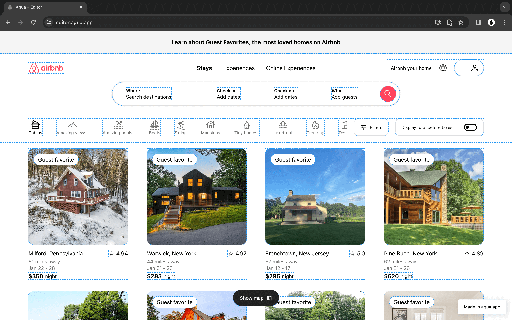
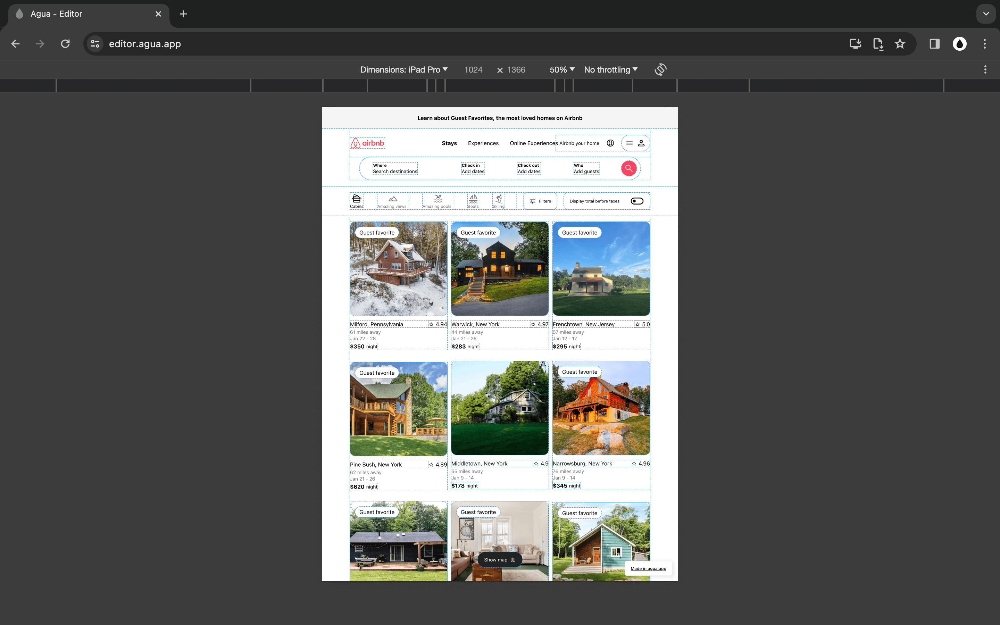
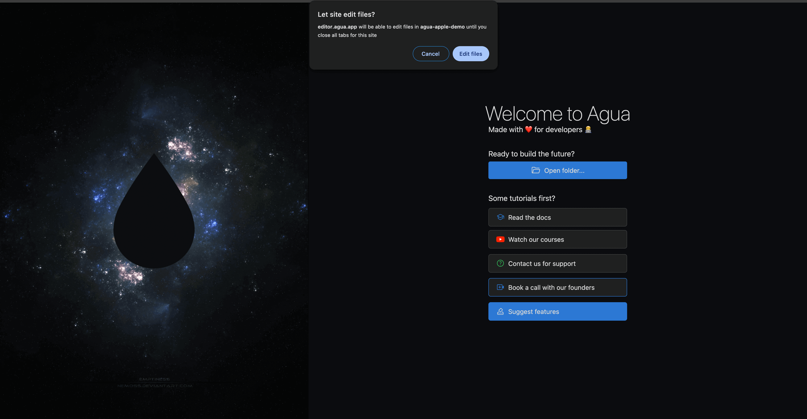
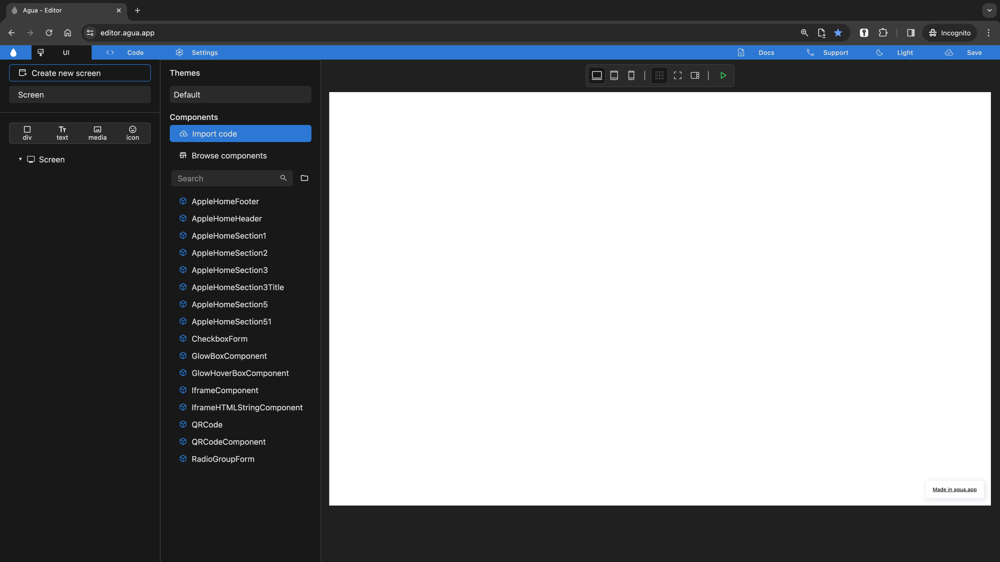

# AirBnb: Tutorial

#### In this tutorial, we'll walk through the process of replicating the UI of [Airbnb](https://www.airbnb.com).

***

You will start by building a [**button**](./#a.-component-button), followed by a [**card**](./#b.-component-card), and the site [**header**](./#c.-home-screen-header). By the end of this tutorial, you will have a responsive interface and its React code resembling Airbnb's homepage.






<figure><figcaption></figcaption></figure>




<figure><figcaption></figcaption></figure>



<figure><figcaption></figcaption></figure>



## Basic Setup:

Retrieve all necessary Airbnb assets from GitHub and start your project in Agua

***

### 1.  Fork and clone GitHub Repo

> **Repo URL:**
>
> [https://github.com/Agua-for-devs/agua-airbnb-demo](https://github.com/Agua-for-devs/agua-airbnb-demo)

### **2.** Open your Repo folder in Agua

> **Sign in URL:**
>
> [https://auth.agua.app/signin/](https://auth.agua.app/signin/)



### &#x20;2.1. Register with your Google Account.

#### -Inside the [Sign in](https://auth.agua.app/signin/)-

<figure><figcaption></figcaption></figure>

***

### 2.2.  Open the Editor.

#### -Inside your [Dashboard](https://console.agua.app/)-

* \[Click] the _Open Editor_ button.

<figure><figcaption></figcaption></figure>

***

### 2.3. Create a project**.**

#### -Inside the [Editor](https://editor.agua.app/)-

* \[Click] the _Open folder_ button.


* Agua is supported on any laptop or desktop regardless of OS.
* Agua works only in [Google Chrome](https://www.google.com/intl/es-419/chrome/).


<figure><figcaption></figcaption></figure>

***

### 2.4 Locate your folder.

#### -Inside your File Explorer-

* Find your Repo folder an \[Click] the _Select_ button.

<figure><figcaption></figcaption></figure>

***

### 2.5. Grant files permission.

#### -Inside the Chrome permission prompt-

* \[Click] the _Edit files_ button.

<figure><figcaption></figcaption></figure>

***

### 2.6. Access your project.

#### -Inside your project [Editor](https://editor.agua.app/)-

<figure><figcaption></figcaption></figure>



## Your will Create:

To understand the basics of Agua, you will build a series of components and sections of the Airbnb UI.

***

### A. [Component: Button](component-button.md)



[Click here](component-button.md) and create an Airbnb button in **5 minutes**!

<figure><figcaption></figcaption></figure>




### B. [Component: Card](component-card/)



[Click here](component-card/) and create an Airbnb card in **15 minutes**!

<figure><figcaption></figcaption></figure>




### C. [Home Screen: Header](home-screen.md)



[Click here](home-screen.md) and create an Airbnb Header in **30 minutes**!

<figure><figcaption></figcaption></figure>



