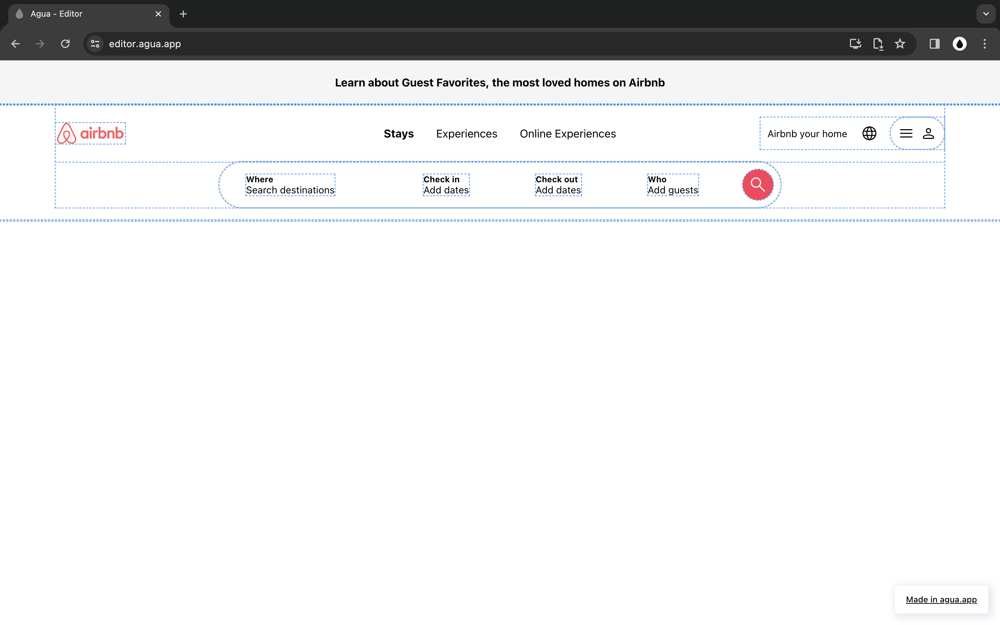

# AirBnb: Tutorial

#### In this tutorial, **you’ll build the UI of**  [**Airbnb**](https://www.airbnb.com/)**.** 

You will replicate Airbnb's Front-end for a user who is looking for a cabin in New York. User interaction start at Airbnbs homepage and follows the information page of a particular Stay. The interface is built responsive and uses a component design approach.



## Your will Create:

### 1. [Component: Button](component-button.md)



[Click here](component-button.md) and create an Airbnb button in **5 minutes**!

<figure><figcaption></figcaption></figure>




### 2. [Component: Card](component-card/)



[Click here](component-card/) and create an Airbnb card in **15 minutes**!

<figure><figcaption></figcaption></figure>




### 3. [Home Screen: Header](home-screen.md)



[Click here](home-screen.md) and create an Airbnb Header in **30 minutes**!

<figure><figcaption></figcaption></figure>



