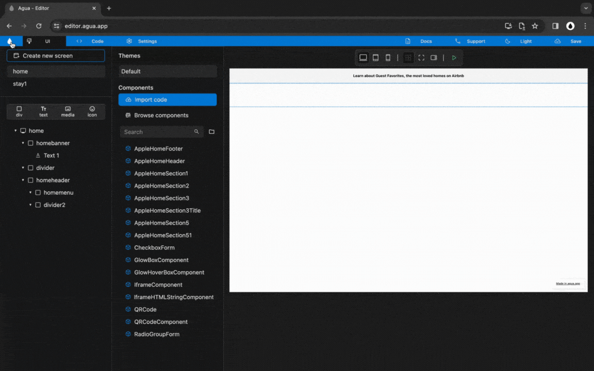

# 3. Desktop Menu

## Step 1:

### Div, and Size.




**You will:**








<figure><figcaption>
Pending to Update.
</figcaption></figure>



### **1.1.** New child _Div,_ inside _"_homemenu":

> **Name:** `homemenudesktop`

1<strong>.1. Written steps</strong>

#### -Inside the _**Element Tree**_-

#### **A. \[Click]** **the **_**Div Icon**_**:**

* The button is located at the top of the panel, below the _Screens._
* The _Icon_ will turn blue, and your pointer will change.

#### **B. Drag your pointer and click "**homemenu**":**

* The new element will appear as a child of the _Screen_.
* The _Div_ will be created with the default name "Layer #".

#### -Inside the **Properties Panel**-

#### **C. \[Click] the current name of the **_**Div**_** and \[type] the new one**:

* The new name should be lowercase, without any spaces or special characters.
* The name will be updated in the _Element Tree_ after you have \[clicked] away.

### **1.2.** Set "homemenu" _Size_:

> **Width**_:_ `Fill`
>
> **Height**: `Wrap`

1<strong>.2. Written steps</strong>

#### -Inside the **Properties Panel**-

#### **A. \[Click]** **the **_**Fill**_** button,** inside the Width section_:_

* The horizontal size of the Div will be the 100% _of the screen._
* You cannot use _Fill size_ in the case there is a parent element in _Wrap size._

#### **B. \[Click]** **the **_**Wrap**_** button,** inside the Height section_:_

* The vertical size of the Div will become its child's maximum combined size.
* You cannot use _Wrap size_ in the case there is a child element in _Fill size_.

### **1.3.** New child _Divs,_ inside _"_homemenudesktop":

> **Name 1 :** `sitemenu`
>
> **Name 2:** `searchmenu`

1<strong>.3. Written steps</strong>

#### -Inside the _**Element Tree**_-

#### **A. \[Click]** **the **_**Div Icon**_**:**

* The button is located at the top of the panel, below the _Screens._
* The _Icon_ will turn blue, and your pointer will change.

#### **B. Drag your pointer and click "**homemenudesktop**":**

* The new element will appear as a child of the _Screen_.
* The _Div_ will be created with the default name "Layer #".

#### -Inside the **Properties Panel**-

#### **C. \[Click] the current name of the **_**Div**_** and \[type] the new one**:

* The new name should be lowercase, without any spaces or special characters.
* The name will be updated in the _Element Tree_ after you have \[clicked] away.

### **1.4.** Set "homemenudesktop" _Size_:

> **Width**_:_ `Fill`
>
> **Height**: `Wrap`

1<strong>.4. Written steps</strong>

#### -Inside the **Properties Panel**-

#### **A. \[Click]** **the **_**Fill**_** button,** inside the Width section_:_

* The horizontal size of the Div will be the 100% _of the screen._
* You cannot use _Fill size_ in the case there is a parent element in _Wrap size._

#### **B. \[Click]** **the **_**Wrap**_** button,** inside the Height section_:_

* The vertical size of the Div will become its child's maximum combined size.
* You cannot use _Wrap size_ in the case there is a child element in _Fill size_.




## Step 2:

### Padding and Alignment.




**You will:**








<figure><figcaption></figcaption></figure>



### 21.1. Set "homemenu" _Padding_:

> **Bottom:** `18`

21<strong>.1. Written steps</strong>

#### -Inside the **Properties Panel**-

#### \[Click] the _Padding Bottom_ container and **\[type]** **the new value**_:_

* You can also change the size value using the _up and down arrows._
* The default _Unit_ is in _Pixels_, you do not need to change it.

### 21.2. Set "homemenudesktop" _Alignment_:

> **Main:** `Axis center`
>
> **Cross:** `Axis center`

21<strong>.2. Written steps</strong>

#### -Inside the **Properties Panel**-

#### **A. \[Click]** **the **_**Main** Axis center_ **button,** inside the Alignment section_:_

* In the Top-Down first row of buttons, choose the Left-to-right second one.
* The items are packed to each other toward the center.

#### **B. \[Click]** **the **_**Cross** Axis center_ **button,** inside the Alignment section_:_

* In the Top-Down second row of buttons, choose the Left-to-right second one.
* The items are packed to each other toward the center.



