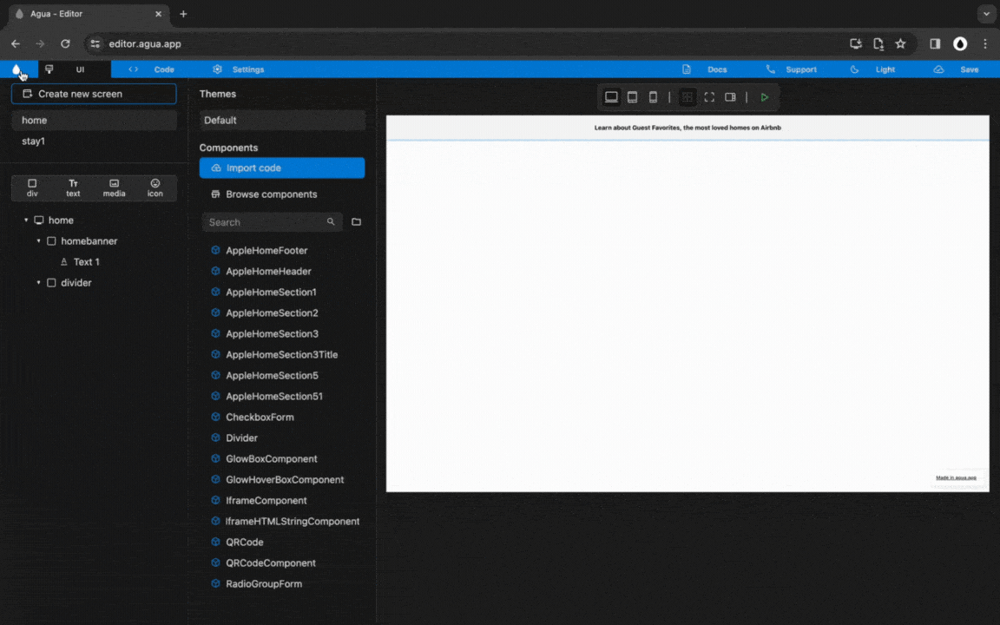

# Home | Header

## Structure and Style




**You will create a Div element:**

*




<figure><figcaption></figcaption></figure>







### **1.1.** New _Div_:

> **Name:** `homeheader`

1<strong>.1. Written steps</strong>

### **1.2.** New child _Divs,_ inside _"_homeheader":

> **Name 1:** `homemenu`
>
> **Name 2:** `homenavbar`

1<strong>.2. Written steps</strong>

### **1.3.** Create a "Divider" _Component_ inside _"_homebanner":

1<strong>.3. Written steps</strong>

### **1.4.** Set "homeheader" _Size_:

> **Width**_:_ `Fill`
>
> **Height**: `Wrap`

<strong>1.4. Written steps</strong>



