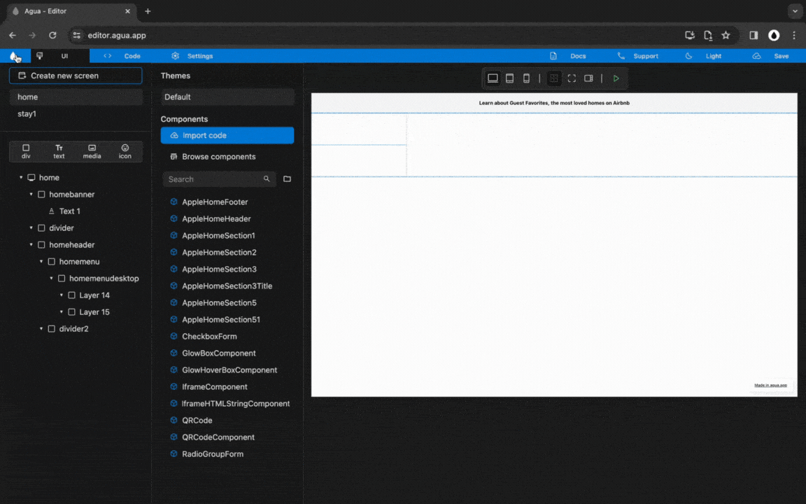

# 3.1. Desktop Menu

## Structure

### Step 1




**You will:**




<figure><figcaption></figcaption></figure>







### **1.1.** New child _Div,_ inside _"_homeheader"_:_

> **Name:** `homemenudesktop`

1<strong>.1. Written steps</strong>

### **1.2.** New child _Divs,_ inside _"_homemenudesktop"_:_

> **Name 1 :** `sitemenu`
>
> **Name 2:** `searchmenu`

1<strong>.2. Written steps</strong>

### **1.3.** Set "homemenudesktop" _Size_:

> **Width**_:_ `Fill`
>
> **Height**: `Wrap`

1<strong>.3. Written steps</strong>




## Site Menu: Elements

### Step 2




**You will:**




<figure><figcaption></figcaption></figure>







### **2.1.**New child _Divs,_ inside _"_sitemenu"_:_

> **Name 1:** `sitemenumap`
>
> **Name 2:** `sitemenulogo`
>
> **Name 3:** `sitemenuusers`

2<strong>.1. Written steps</strong>

### **2.2.** Set "sitemenu" _Size_:

> **Width**_:_ `Fill`
>
> **Height**: `Wrap`

2<strong>.2. Written steps</strong>

### 2.3. Set "sitemenu" _Alignment_:

> **Main:** `Axis center`
>
> **Cross:** `Axis center`

2<strong>.3. Written steps</strong>

### **2.4.** Set "sitemenu" _Orientation:_

> `Horizontal`

2<strong>.4. Written steps</strong>




### Step 3




**You will:**




<figure><figcaption></figcaption></figure>







### **3.1.** New child _Texts,_ inside _"_sitemenumap"_:_

> **Name 1:** `sitemenutext1`
>
> **Name 2:** `sitemenutext2`
>
> **Name 3:** `sitemenutext3`

3<strong>.1. Written steps</strong>

### **3.2.** New child _Media,_ inside _"_sitemenulogo"_:_

> **Name:** `sitemenumedia1`

3<strong>.2. Written steps</strong>

### **3.3.** New child _Text,_ inside _"_sitemenuusers"_:_

> **Name:** `sitemenutext4`

3<strong>.3. Written steps</strong>

### **3.4.** New child _Icon,_ inside _"_sitemenuusers"_:_

> **Name:** `sitemenuicon1`

3<strong>.4. Written steps</strong>

### **3.5.** New child _Div,_ inside _"_sitemenuusers"_:_

> **Name:** `sitemenudiv1`

3<strong>.5. Written steps</strong>

### **3.6.** New child _Icons,_ inside _"_sitemenumap"_:_

> **Name 1:** `sitemenuicon2`
>
> **Name 2:** `sitemenuicon3`

3<strong>.6. Written steps</strong>




### Step 4




**You will:**




<figure><figcaption></figcaption></figure>







### **4.1.** Set "sitemenumap" _Size_:

> **Width**_:_ `Fill`
>
> **Height**: `Fill`

4<strong>.1. Written steps</strong>

### 4.2. Set "sitemenu" _Alignment_:

> **Main:** `Axis center`
>
> **Cross:** `Axis center`

4<strong>.2. Written steps</strong>

### **4.3.** Set "sitemenulogo, sitemenuusers, and sitemenudiv1" _Size_:

> **Width**_:_ `Wrap`
>
> **Height**: `Wrap`

4<strong>.3. Written steps</strong>

### **4.3.** Set "sitemenu, sitemenumap, and sitemenuusers" _Orientation:_&#x20;

> `Horizontal`

4<strong>.4. Written steps</strong>




## Site Menu: Position

### Steps 5




**You will:**




<figure><figcaption></figcaption></figure>







### **5.1.** Set "sitemenu" _Position_:

> `Relative`

5<strong>.1. Written steps</strong>

### **5.2.** Set "sitemenumap" _Position_:

> `Absolute`

5<strong>.2. Written steps</strong>

### **5.3.** Set "sitemenulogo, and sitemenuusers" _z-index_:

> `1`

5<strong>.3. Written steps</strong>




### Steps 6




**You will:**




<figure><figcaption></figcaption></figure>







### 6.1. Set "homemenu" _Padding_:

> **Left:** `80`
>
> **Right:** `80`

6<strong>.1. Written steps</strong>

### **6.2.** Set "sitemenumedia1" _Size_:

> **Width**_:_ `100 px`
>
> **Height**: `30 px`

6<strong>.2. Written steps</strong>




## Site Menu: Media

### Step 7




**You will:**




<figure><figcaption></figcaption></figure>







### 7.1. Set "sitemenumedia1" _Image Source:_

> `Assets/Brand/Airbnb_logo.png`

7<strong>.1. Written steps</strong>

### 7.2. Set "sitemenutext1" _Text_:

> `Stays`

7<strong>.2. Written steps</strong>

### 7.3. Set "sitemenutext2" _Text_:

> `Experiences`

7<strong>.3. Written steps</strong>

### 7.4. Set "sitemenutext3" _Text_:

> `Online Experiences`

7<strong>.4. Written steps</strong>

### 7.5. Set "sitemenutext4" _Text_:

> `Airbnb your home`

7<strong>.5. Written steps</strong>

### 7.6. Set "sitemenuicon1" _Icon_:

> `language`

7<strong>.6. Written steps</strong>

### 7.7. Set "sitemenuicon2" _Icon_:

> `menu`

7<strong>.7. Written steps</strong>

### 7.8. Set "sitemenuicon3" _Icon_:

> `person_outline`

7<strong>.8. Written steps</strong>




## Site Menu: Style

### Step 8




**You will:**




<figure><figcaption></figcaption></figure>







### 8.1. Set "homemenu" _Padding_:

> **Top:** `18`
>
> **Bottom:** `18`
>
> **Left:** `80`
>
> **Right:** `80`

8<strong>.1. Written steps</strong>

### 8.2. Set "sitemenutext1, sitemenutext2 and sitemenutext3" _Margin_:

> **Left:** `16`
>
> **Right:** `16`

8<strong>.2. Written steps</strong>




### Step 9




**You will:**




<figure><figcaption></figcaption></figure>







### 9.1. Set "sitemenudiv1" _Border Color_:

> `E0E0E0`

9<strong>.1. Written steps</strong>

### 9.2. Set "sitemenudiv1" _Border Width_:

> `1`

9<strong>.2. Written steps</strong>

### 9.3. Set "sitemenudiv1" _Radius_:

> `25`

9<strong>.3. Written steps</strong>

### 9.4. Set "sitemenudiv1" _Padding_:

> **Top:** `10`
>
> **Bottom:** `10`

9<strong>.4. Written steps</strong>

### 9.5. Set "sitemenudiv1" _Margin_:

> **Left:** `8`

9<strong>.5. Written steps</strong>

### 9.6. Set "sitemenuicon2" _Padding_:

> **Left:** `10`
>
> **Right:** `4`

9<strong>.6. Written steps</strong>

### 9.7. Set "sitemenuicon3" _Padding_:

> **Left:** `4`
>
> **Right:** `10`

9<strong>.7. Written steps</strong>




### Step 10




**You will:**




<figure><figcaption></figcaption></figure>







### 10.1. Set "sitemenutext4, sitemenuicon1" _Margin_:

> **Left:** `10`
>
> **Right:** `10`

10<strong>.1. Written steps</strong>

### 10.2. Set "sitemenutext4" _Font Size_:

> `14`

10<strong>.2. Written steps</strong>

### 10.3. Set "sitemenuicon1, sitemenuicon2, sitemenuicon3" _Icon Size_:

> `24`

10<strong>.13 Written steps</strong>




### Step 11




**You will:**




<figure><figcaption></figcaption></figure>







### 11.1. Set "menuusers" _Alignment_:

> **Main:** `Axis center`
>
> **Cross:** `Axis center`

11<strong>.1. Written steps</strong>

### 11.2. Set "sitemenutext1, sitemenutext2, sitemenutext3" _Font Size_:

> `16`

11<strong>.2. Written steps</strong>

### 11.3. Set "sitemenutext1" _Text_:

> `[B] Bold`

11<strong>.3. Written steps</strong>

* If used before, the Bold toggle needs to be set to neutral and then back to Bold.




## Search Menu: Elements

### Step 12




**You will:**




<figure><figcaption></figcaption></figure>







### **12.1.** New child _Divs,_ inside _"_searchmenu"_:_

> **Name 1 :** `searchmenudiv1`
>
> **Name 2 :** `searchmenudiv2`
>
> **Name 3 :** `searchmenudiv3`
>
> **Name 4 :** `searchmenudiv4`
>
> **Name 5 :** `searchmenudiv5`

12<strong>.1. Written steps</strong>

### **12.2.** Set "sitemenumedia1" _Size_:

> **Width**_:_ `Wrap`
>
> **Height**: `Wrap`

12<strong>.2. Written steps</strong>

### 12.3. Set "searchmenu" _Orientation_:

> `Horizontal`

12<strong>.3. Written steps</strong>

### 12.4. Set "searchmenu" _Padding_

> **Top:** `10`
>
> **Bottom:** `10`
>
> **Left:** `10`
>
> **Right:** `10`

12<strong>.4. Written steps</strong>




### Step 13




**You will:**




<figure><figcaption></figcaption></figure>







### **13.1.** New child _Texts,_ inside _"_searchmenudiv1"_:_

> **Name 1 :** `searchmenudiv1text1`
>
> **Name 2 :** `searchmenudiv1text2`

13<strong>.1. Written steps</strong>

### **13.2.** New child _Texts,_ inside _"_searchmenudiv2"_:_

> **Name 1 :** `searchmenudiv2text1`
>
> **Name 2 :** `searchmenudiv2text2`

13<strong>.2. Written steps</strong>

### **13.3.** New child _Texts,_ inside _"_searchmenudiv3"_:_

> **Name 1 :** `searchmenudiv3text1`
>
> **Name 2 :** `searchmenudiv3text2`

13<strong>.3. Written steps</strong>

### **13.4.** New child _Texts,_ inside _"_searchmenudiv4"_:_

> **Name 1 :** `searchmenudiv4text1`
>
> **Name 2 :** `searchmenudiv4text2`

13<strong>.4. Written steps</strong>

### **13.5.** New child _Icon,_ inside _"_searchmenudiv5"_:_

> **Name :** `searchmenudiv5icon1`

13<strong>.5. Written steps</strong>




### Step 14




**You will:**




<figure><figcaption></figcaption></figure>







### 14.1. Set "searchmenu" _Alignment_:

> **Main:** `Axis center`
>
> **Cross:** `Axis center`

13<strong>.1. Written steps</strong>

### **14.2.** Set "searchmenudiv1, ..., and searchmenudiv5" _Size_:

> **Width**_:_ `Wrap`
>
> **Height**: `Wrap`



### Step 15




**You will:**




<figure><figcaption></figcaption></figure>







### 15.1. Set "searchmenudiv1" _Margin_:

> **Left:** `28`
>
> **Right:** `64`

15<strong>.1. Written steps</strong>

### 15.2. Set "searchmenudiv2" _Margin_:

> **Left:** `64`
>
> **Right:** `48`

14<strong>.4. Written steps</strong>

### 15.3. Set "searchmenudiv3" _Margin_:

> **Left:** `48`
>
> **Right:** `48`

14<strong>.5. Written steps</strong>

### 15.4. Set "searchmenudiv4" _Margin_:

> **Left:** `48`
>
> **Right:** `64`

14<strong>.6. Written steps</strong>

### 15.5. Set "searchmenudiv3" _Margin_:

> **Left:** `60`

14<strong>.7. Written steps</strong>




### Step 16




**You will:**




<figure><figcaption></figcaption></figure>







### 16.1. Set "searchmenudiv1text1" _Text_:

> `Where`

16<strong>.1. Written steps</strong>

### 16.2. Set "searchmenudiv1text2" _Text_:

> `Search destinations`

16<strong>.2. Written steps</strong>

### 16.3. Set "searchmenudiv2text1" _Text_:

> `Check in`

16<strong>.3. Written steps</strong>

### 16.4. Set "searchmenudiv2text2" _Text_:

> `Add dates`

16<strong>.4. Written steps</strong>

### 16.5. Set "searchmenudiv3text1" _Text_:

> `Check out`

16<strong>.5. Written steps</strong>

### 16.6. Set "searchmenudiv3text2" _Text_:

> `Add dates`

16<strong>.6. Written steps</strong>

### 16.7. Set "searchmenudiv4text1" _Text_:

> `Who`

16<strong>.7. Written steps</strong>

### 16.8. Set "searchmenudiv4text2" _Text_:

> `Add guests`

16<strong>.8. Written steps</strong>

### 16.9. Set "searchmenudiv5ticon1" _Icon_:

> `search`

16<strong>.9. Written steps</strong>




### Step 17




**You will:**




<figure><figcaption></figcaption></figure>







### 17.1. Set "searchmenudiv1text1, ..., and searchmenudiv4text1" _Font Size_:

> `12`

### 17.2. Set "searchmenudiv1text1, ..., and searchmenudiv4text1":

> `[B] Bold`

### 17.3. Set "searchmenudiv1text2, ..., and searchmenudiv4text2" _Font Size_:

> `14`

### 17.4. Set "searchmenudiv5ticon1" _Icon Size_:

> `24`



## Search Menu: Style

### Step 18




**You will:**




<figure><figcaption></figcaption></figure>







### 16.1. Set "searchmenu" _Border Color_ to:

`E0E0E0`

### 16.2. Set "searchmenu" _Border Width_ to:

`1`

### 16.3. Set "searchmenu" _Radius_ to:

`50`

### 16.4. Set "searchmenu" _Shadow Blur_ to:

`5`

### 16.4. Set "searchmenu" _Shadow Color_ to:

`E0E0E0`



### Step 19




**You will:**




<figure><figcaption></figcaption></figure>







### 17.1. Set "searchmenudiv5" _Background Color_ to:

`FF385C`

### 17.2. Set "searchmenudiv5" _Radius_ to:

`25`

### 17.3. Set "searchmenudiv5" _Padding_ to:

`Top: 8`

`Bottom: 8`

`Left: 8`

`Right: 8`



### Step 20




**You will:**




<figure><figcaption></figcaption></figure>







### 18.1. Set "searchmenudiv5ticon1" _Icon Size_ to:

`28`

### 18.2. Set "searchmenudiv5ticon1" _Icon Color_ to:

`FFFFFF`



## General Styling

### Step 21




**You will:**




<figure><figcaption></figcaption></figure>







### 19.1. Set "homemenu" _Padding_ to:

`Bottom: 18`

### 19.2. Set "homemenudesktop" _Alignment_ to:

`Main Axis center`

`Cross Axis center`



***
