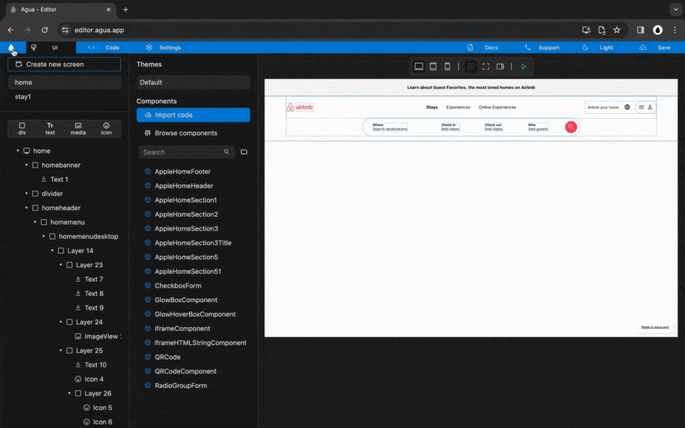

# 3.2. Tablet Menu

## Structure

### Step 1




**You will:**




<figure><figcaption></figcaption></figure>







### **1.1.** New child _Div,_ inside _"_homemenu"_:_

> **Name:** `homemenutablet`

1<strong>.1. Written steps</strong>

### 1.2. Copy and paste "sitemenulogo" into "homemenutablet":

> **Copy:**  `[ctrl c ] or [cmd c]`
>
> **Paste:** `[ctrl v ] or [cmd v]`

1<strong>.2. Written steps</strong>

### 1.3. Copy and paste "sitemenuusers" into "homemenutablet":

> **Copy:**  `[ctrl c ] or [cmd c]`
>
> **Paste:** `[ctrl v ] or [cmd v]`

1<strong>.3. Written steps</strong>




### Step 2




**You will:**




<figure><figcaption></figcaption></figure>







### **2.1.** Set "homemenutablet" _Size_:

> **Width**_:_ `Fill`
>
> **Height**: `Wrap`

2<strong>.1. Written steps</strong>

### 2.2. Set "homemenutablet" _Alignment_:

> **Main axis:** `center`
>
> **Cross axis:** `distribute`

2<strong>.2. Written steps</strong>

### 2.3. Set "homemenutablet" _Orientation_:

> `Horizontal`

2<strong>.3. Written steps</strong>

### **2.4.** New child _Div,_ inside _"_homemenutable"_:_

> **Name:** `searchmenutablet`

2<strong>.4. Written steps</strong>




## Elements

### Step 3




**You will:**




<figure><figcaption></figcaption></figure>







### **3.1.** New child _Divs,_ inside _"_searchmenutablet"_:_

> **Name 1 :** `searchmenutabletdiv1`
>
> **Name 2:** `searchmenutabletdiv2`
>
> **Name 3:** `searchmenutabletdiv3`
>
> **Name 4:** `searchmenutabletdiv4`

3<strong>.1. Written steps</strong>

### **3.2.** Set "searchmenutablet" _Size_:

> **Width**_:_ `Wrap`
>
> **Height**: `Wrap`

3<strong>.2. Written steps</strong>

### 3.3. Set "searchmenutablet" _Orientation_:

> `Horizontal`

3<strong>.3. Written steps</strong>




### Step 4




**You will:**












### 4.1. New child _Text,_ inside _"_searchmenutabletdiv1"_:_

> **Name:** `searchmenutablettext1`

4<strong>.1. Written steps</strong>

### 4.2. New child _Text,_ inside _"_searchmenutabletdiv1"_:_

> **Name:** `searchmenutablettext2`

4<strong>.2. Written steps</strong>

### 4.3. New child _Text,_ inside _"_searchmenutabletdiv3"_:_

> **Name:** `searchmenutablettext3`

4<strong>.3. Written steps</strong>

### 4.4. New child _Icon,_ inside _"_searchmenutabletdiv4"_:_

> **Name:** `searchmenutableticon1`

4<strong>.4. Written steps</strong>

### **4.5.** Set "searchmenutabletdiv1, searchmenutabletdiv2, searchmenutabletdiv3, and searchmenutabletdiv4" _Size_:

> **Width**_:_ `Wrap`
>
> **Height**: `Wrap`

4<strong>.5. Written steps</strong>




### Step 5




**You will:**












### 5.1. Set "searchmenutablettext1" _Text_:

> `Anywhere`

5<strong>.1. Written steps</strong>

### 5.2. Set "searchmenutablettext2" _Text_:

> `Any week`

5<strong>.2. Written steps</strong>

### 5.3. Set "searchmenutablettext3" _Text_:

> `Add guests`

5<strong>.3. Written steps</strong>

### 5.4. Set "searchmenutableticon1" _Text_:

> `search`

5<strong>.4. Written steps</strong>




## Responsive Styling

### Step 6




**You will:**




<figure><figcaption></figcaption></figure>







### 6.1. Uncheck _Visibility_ of "homemenutablet":

> **Visible:** `[unchecked]`

6<strong>.1. Written steps</strong>

### 6.2. Open _Tablet View:_

6<strong>.2. Written steps</strong>

### 6.3. Check _Visibility_ of "homemenutablet:

> **Visible:** `[checked]`

6<strong>.3. Written steps</strong>

### 6.4. Uncheck _Visibility_ of "homemenudesktop":

> **Visible:** `[unchecked]`

6<strong>.4. Written steps</strong>




### Step 7




**You will:**




<figure><figcaption></figcaption></figure>







### 7.1. Set "homemenu" _Padding_:

> **Top:** `15`
>
> **Bottom:** `15`
>
> **Left:** `40`
>
> **Right:** `40`

7<strong>.1. Written steps</strong>

### 7.2. Set "searchmenutablet" _Padding_:

> **Top:** `6`
>
> **Bottom:** `6`
>
> **Left:** `6`
>
> **Right:** `6`

7<strong>.2. Written steps</strong>

### 7.3. Set "searchmenutablet" _Margin_:

> **Left:** `10`
>
> **Right:** `10`

7<strong>.3. Written steps</strong>




### Step 8




**You will:**




<figure><figcaption></figcaption></figure>







### 7.2. Set "searchmenutablet, searchmenutabletdiv1, searchmenutabletdiv2, and searchmenutabletdiv3" _Margin_:

> **Left:** `10`
>
> **Right:** `10`

7<strong>.2. Written steps</strong>

### 7.3. Set "searchmenutabletdiv4" _Margin_:

> **Left:** `10`

7<strong>.3. Written steps</strong>

### k

### 7.1. Set "searchmenutablettext1, searchmenutablettext2, and searchmenutablettext3" _Font Size_:

> `14`

7<strong>.1. Written steps</strong>

### 7.2. Set "searchmenutablettext1, and searchmenutablettext2" _Font Style_:

> `[B] Bold`

7<strong>.2. Written steps</strong>




### Step 9




**You will:**




<figure><figcaption></figcaption></figure>







### 8.1. Set "searchmenutabletdiv4" _Background Color_:

> `FF385C`

8<strong>.1. Written steps</strong>

### 8.2. Set "searchmenutabletdiv4" _Radius_:

> `25`

8<strong>.2. Written steps</strong>

### 8.3. Set "searchmenutabletdiv4" _Padding_:

> **Top:** `8`
>
> **Bottom:** `8`
>
> **Left:** `8`
>
> **Right:** `8`

8<strong>.3. Written steps</strong>

### 8.4. Set "searchmenutableticon1" _Icon Size_ to:

> `20`

8<strong>.4. Written steps</strong>

### 8.5. Set "searchmenutableticon1" _Icon Color:_

> `FFFFFF`

8<strong>.5. Written steps</strong>




### Step 10




**You will:**




<figure><figcaption></figcaption></figure>







### 9.1. Set "searchmenutablet" _Border Color_:

> `E0E0E0`

9<strong>.1. Written steps</strong>

### 9.2. Set "searchmenutablet" _Border Width_:

> `1`

9<strong>.2. Written steps</strong>

### 9.3. Set "searchmenutablet" _Radius_:

> `50`

8<strong>.4. Written steps</strong>

### 9.4. Set "searchmenutablet" _Shadow Blur_:

> `5`

9<strong>.4. Written steps</strong>

### 9.5. Set "searchmenutablet" _Shadow Color_:

> `E0E0E0`

9<strong>.5. Written steps</strong>




### Step 11




**You will:**




<figure><figcaption></figcaption></figure>







### 11.2 Set "sitemenumedia1" _Image Source_ to:

`Assets/Brand/Airbnb_logo.png`

### 11.3 Set "sitemenumedia1" _Size_ to:

Width_:_ `30 px`

### 7.2. Set "searchmenutablet, searchmenutabletdiv1, searchmenutabletdiv2, and searchmenutabletdiv3" _Margin_:

> **Left:** `5`
>
> **Right:** `5`




### Step 12




**You will:**




<figure><figcaption></figcaption></figure>







### 12.1. Open _Mobile View_

### 12.2. Unselect _Visibility_ of "homemenutablet"

### 12.3. Unselect _Visibility_ of "homemenudesktop"


