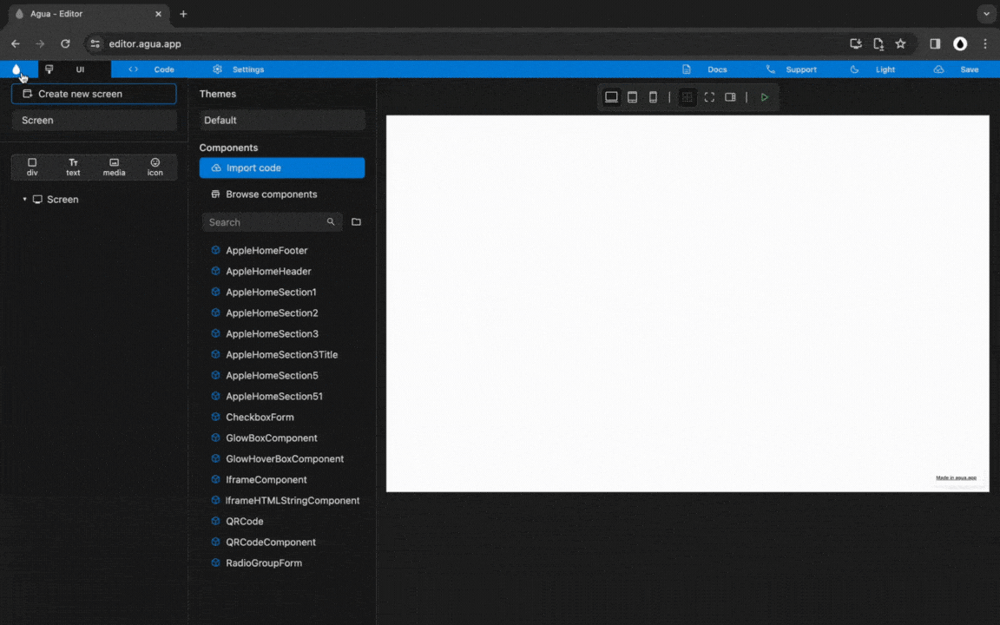

# Divider

## 1. Element and Style



### **1.1.** Create a _Div_ with the name:

> `divider`

#### **1.2.** Set "divider" _Size_ to:

> Width_:_ `Fill`
>
> Height: `1 px`

#### 1.4. Set "homebanner" _Background Color_ to:

> `E0E0E0`



<figure><figcaption></figcaption></figure>



<figure><figcaption></figcaption></figure>





## 2. Component



### `Component` and  `Component Preview`.

<figure><figcaption></figcaption></figure>

#### **2.1.** Open _Create Component._

#### **2.2.** Define the _Component Name:_

> `divider`

#### **2.3.** Define if "divider" _is a template:_

> `[Unmark]`

#### **2.4.** _Create Component._

#### **2.5.** Open _Contextual Panel._

#### **2.6.** Open "Divider" _Preview._



***
