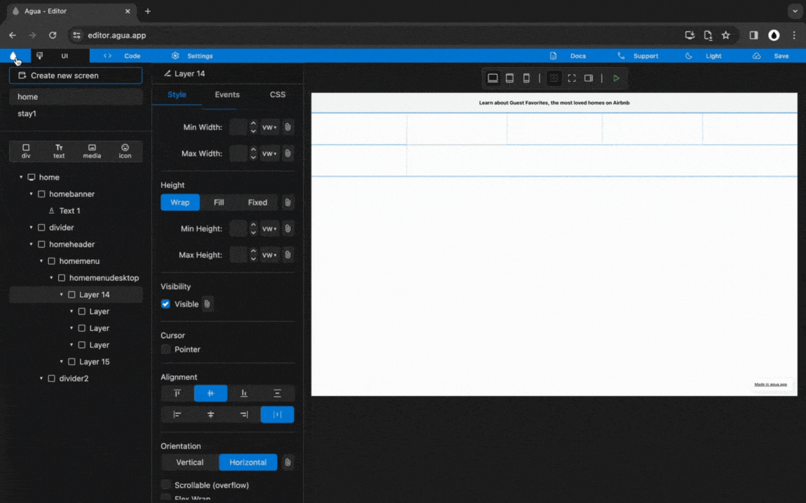

# 3.1 Desktop Menu

## Structure



### `Div` and `Size`.

<figure><figcaption></figcaption></figure>

### **1.1.** Create a _Div_ with the name:

`homemenudesktop`

### **1.2.** Create 2 child _Divs_ inside of "homemenudesktop" with the names:

`sitemenu`

`searchmenu`

### **1.3.** Set "homemenudesktop" _Size_ to:

Width_:_ `Fill`

Height: `Wrap`

### **1.4.** Set "homemenu" _Size_ to:

Height: `Wrap`



***

## Site Menu: Elements



### `Div`, `Size`, `Alignment`, and `Orientation`.

<figure><figcaption></figcaption></figure>

### **2.1.** Create 3 child _Divs_ inside of "sitemenu" with the names:

`sitemenumap`

`sitemenulogo`

`sitemenuusers`

### **2.2.** Set "sitemenu" _Size_ to:

Width_:_ `Fill`

Height: `Wrap`

### 2.3. Set "sitemenu" _Alignment_ to:

`Main Axis center`

`Cross Axis center`

### 2.4. Set "sitemenu" _Orientation_ to:

`Horizontal`



### `Text`, `Media`, `Icon`, and `Div`.

<figure><figcaption></figcaption></figure>

### **3.1.** Create 3 child _Texts_ inside of "sitemenumap" with the names:

`sitemenutext1`

`sitemenutext2`

`sitemenutext3`

### **3.2.** Create a _Media_ inside of "sitemenulogo":

`sitemenumedia1`

### **3.3.** Create a _Text_ inside of "sitemenuusers":

`sitemenutext4`

### **3.4.** Create an _Icon_ inside of "sitemenuusers":

`sitemenuicon1`

### **3.5.** Create a _Div_ inside of "sitemenuusers" with the name:

`sitemenudiv1`

### **3.6.** Create 2 child _Icons_ inside of "sitemenudiv1" with the names:

`sitemenuicon2`

`sitemenuicon3`



### `Div`, `Size`, `Alignment`, and `Orientation`.

<figure><figcaption></figcaption></figure>

### **4.1.** Set "sitemenumap" _Size_ to:

Width_:_ `Fill`

Height: `Wrap`

### 4.2. Set "sitemenumap" _Alignment_ to:

`Main Axis center`

`Cross Axis center`

### 4.3. Set "sitemenumap" _Orientation_ to:

`Horizontal`

### **4.4.** Set "sitemenulogo" _Size_ to:

Width_:_ `Wrap`

Height: `Wrap`

### **4.5.** Set "sitemenuusers" _Size_ to:

Width_:_ `Wrap`

Height: `Wrap`

### 4.6. Set "sitemenuusers" _Orientation_ to:

`Horizontal`

### **4.7.** Set "sitemenudiv1" _Size_ to:

Width_:_ `Wrap`

Height: `Wrap`

### 4.8. Set "sitemenudiv1" _Orientation_ to:

`Horizontal`



***

## Site Menu: Position



### `Position` and `Z-index`.

<figure><figcaption></figcaption></figure>

### **5.1.** Set "sitemenu" _Position_ to:

`Position Relative`

### **5.2.** Set "sitemenumap" _Position_ to:

`Position Absolute`

### **5.3.** Set "sitemenulogo" _z-index_ to:

`1`

### **5.4.** Set "sitemenuusers" _z-index_ to:

`1`



### `Size` and `Padding`.

<figure><figcaption></figcaption></figure>

### 6.1. Set "homemenu" _Padding_ to:

`Left: 80`

`Right: 80`

### **6.2.** Set "sitemenumedia1" _Size_ to:

Width_:_ `100 px`

Height: `30 px`



***

## Site Menu: Media



### `Text`, `Media`, and `Icon`.

<figure><figcaption></figcaption></figure>

### 7.1. Set "sitemenumedia1" _Image Source_ to:

`Assets/Brand/Airbnb_logo.png`

### 7.2. Set "sitemenutext1" _Text_ to:

`Stays`

### 7.3. Set "sitemenutext2" _Text_ to:

`Experiences`

### 7.4. Set "sitemenutext3" _Text_ to:

`Online Experiences`

### 7.5. Set "sitemenutext4" _Text_ to:

`Airbnb your home`

### 7.6. Set "sitemenuicon1" _Icon_ to:

`language`

### 7.7. Set "sitemenuicon2" _Icon_ to:

`menu`

### 7.8. Set "sitemenuicon3" _Icon_ to:

`person_outline`



***

## Site Menu: Styling



### `Padding` and `Margin`.

<figure><figcaption></figcaption></figure>

### 8.1. Set "sitemenu" _Padding_ to:

`Top: 18`

`Bottom: 18`

`Left: 80`

`Right: 80`

### 8.2. Set "sitemenutext1" _Margin_ to:

`Left: 16`

`Right: 16`

### 8.3. Set "sitemenutext2" _Margin_ to:

`Left: 16`

`Right: 16`

### 8.4. Set "sitemenutext3" _Margin_ to:

`Left: 16`

`Right: 16`



### `Borders`, `Radius`, `Padding`, and `Margin`.

<figure><figcaption></figcaption></figure>

### 9.1. Set "sitemenudiv1" _Border Color_ to:

`E0E0E0`

### 9.2. Set "sitemenudiv1" _Border Width_ to:

`1`

### 9.3. Set "sitemenudiv1" _Radius_ to:

`25`

### 9.4. Set "sitemenudiv1" _Padding_ to:

`Top: 10`

`Bottom: 10`

### 9.5. Set "sitemenudiv1" _Margin_ to:

`Left: 8`

### 9.6. Set "sitemenuicon2" _Padding_ to:

`Left: 10`

`Right: 4`

### 9.7. Set "sitemenuicon3" _Padding_ to:

`Left: 4`

`Right: 10`



### `Font Size`, `Icon Size`, and `Margin`.

<figure><figcaption></figcaption></figure>

### 10.1. Set "sitemenutext4" _Margin_ to:

`Left: 10`

`Right: 10`

### 10.2. Set "sitemenutext4" _Font Size_ to:

`14`

### 10.3. Set "sitemenuicon1" _Icon Size_ to:

`24`

### 10.4. Set "sitemenuicon1" _Margin_ to:

`Left: 10`

`Right: 10`

### 10.5. Set "sitemenuicon1" _Icon Size_ to:

`24`

### 10.6. Set "sitemenuicon1" _Icon Size_ to:

`24`



### `Size`, `Alignment`, `Font`, and `Font Size`.

<figure><figcaption></figcaption></figure>

### 11.1. Set "menuusers" _Alignment_ to:

`Main Axis center`

`Cross Axis center`

### **11.2.** Set "menusitemap" _Size_ to:

Height: `Fill`

### 11.3. Set "sitemenutext1" _Font Size_ to:

`16`

### 11.4. Set "sitemenutext1" _Text_ to:

`[B] Bold`

#### Note:

If used before, The Bold toggle needs to be set to neutral and then set to Bold again.

### 11.5. Set "sitemenutext2" _Font Size_ to:

`16`

### 11.6. Set "sitemenutext3" _Font Size_ to:

`16`



***

## Search Menu: Elements



### `Div`, `Size`,  `Orientation`, and `Padding`.

<figure><figcaption></figcaption></figure>

### **12.1.** Create 5 child _Divs_ inside of "searchmenu" with the names:

`searchmenudiv1`

`searchmenudiv2`

`searchmenudiv3`

`searchmenudiv4`

`searchmenudiv5`

### **12.2.** Set "searchmenu" _Size_ to:

Width_:_ `Wrap`

Height: `Wrap`

### 12.3. Set "searchmenu" _Orientation_ to:

`Horizontal`

### 12.4. Set "searchmenu" _Padding_ to:

`Top: 10`

`Bottom: 10`

`Left: 10`

`Right: 10`



### `Alignment`, `Text`, `Size`, and `Margin`.

<figure><figcaption></figcaption></figure>

### 13.1. Set "searchmenu" _Alignment_ to:

`Main Axis center`

`Cross Axis center`

### **13.2.** Create 2 child _Texts_ inside of "searchmenudiv1" with the names:

`searchmenudiv1text1`

`searchmenudiv1text2`

### **13.3.** Set "searchmenudiv1" _Size_ to:

Width_:_ `Wrap`

Height: `Wrap`

### 13.4. Set "searchmenudiv1" _Margin_ to:

`Left: 28`

`Right: 64`

### **13.5.** Create 2 child _Texts_ inside of "searchmenudiv2" with the names:

`searchmenudiv2text1`

`searchmenudiv2text2`

### **13.6.** Set "searchmenudiv2" _Size_ to:

Width_:_ `Wrap`

Height: `Wrap`

### 13.7. Set "searchmenudiv2" _Margin_ to:

`Left: 64`

`Right: 48`

### **13.8.** Create 2 child _Texts_ inside of "searchmenudiv3" with the names:

`searchmenudiv3text1`

`searchmenudiv3text2`

### **13.9.** Set "searchmenudiv3" _Size_ to:

Width_:_ `Wrap`

Height: `Wrap`

### 13.10. Set "searchmenudiv3" _Margin_ to:

`Left: 48`

`Right: 48`

### **13.11.** Create 2 child _Texts_ inside of "searchmenudiv4" with the names:

`searchmenudiv4text1`

`searchmenudiv4text2`

### **13.12.** Set "searchmenudiv4" _Size_ to:

Width_:_ `Wrap`

Height: `Wrap`

### 13.13. Set "searchmenudiv4" _Margin_ to:

`Left: 48`

`Right: 64`

### **13.14.** Create an _Icon_ inside of "searchmenudiv5" with the name:

`searchmenudiv5ticon1`

### **13.15.** Set "searchmenudiv5" _Size_ to:

Width_:_ `Wrap`

Height: `Wrap`



### `Text` and `Icon`.

### 14.1. Set "searchmenudiv1text1" _Text_ to:

`Where`

### 14.2. Set "searchmenudiv1text2" _Text_ to:

`Search destinations`

### 14.3. Set "searchmenudiv2text1" _Text_ to:

`Check in`

### 14.4. Set "searchmenudiv2text2" _Text_ to:

`Add dates`

### 14.5. Set "searchmenudiv3text1" _Text_ to:

`Check out`

### 14.6. Set "searchmenudiv3text2" _Text_ to:

`Add dates`

### 14.7. Set "searchmenudiv4text1" _Text_ to:

`Who`

### 14.8. Set "searchmenudiv4text2" _Text_ to:

`Add guests`

### 14.9. Set "searchmenudiv5ticon1" _Icon_ to:

`search`



### `Font` and `Font Size`.

### 15.1. Set "searchmenudiv1text1" _Font Size_ to:

`12`

### 15.2. Set "searchmenudiv1text1" _Text_ to:

`[B] Bold`

### 15.3. Set "searchmenudiv1text2" _Font Size_ to:

`14`

### 15.4. Set "searchmenudiv1text1" _Font Size_ to:

`12`

### 15.5. Set "searchmenudiv1text1" _Text_ to:

`[B] Bold`

### 15.6. Set "searchmenudiv1text2" _Font Size_ to:

`14`

### 15.7. Set "searchmenudiv1text1" _Font Size_ to:

`12`

### 15.8. Set "searchmenudiv1text1" _Text_ to:

`[B] Bold`

### 15.9. Set "searchmenudiv1text2" _Font Size_ to:

`14`

### 15.10. Set "searchmenudiv1text1" _Font Size_ to:

`12`

### 15.11. Set "searchmenudiv1text1" _Text_ to:

`[B] Bold`

### 15.12. Set "searchmenudiv1text2" _Font Size_ to:

`14`

### 15.13. Set "searchmenudiv5ticon1" _Icon Size_ to:

`24`



***

## Search Menu: Styling



### `Border`, `Radius`, and `Shadow`.

<figure><figcaption></figcaption></figure>

### 16.1. Set "searchmenu" _Border Color_ to:

`E0E0E0`

### 16.2. Set "searchmenu" _Border Width_ to:

`1`

### 16.3. Set "searchmenu" _Radius_ to:

`50`

### 16.4. Set "searchmenu" _Shadow Blur_ to:

`5`

### 16.4. Set "searchmenu" _Shadow Color_ to:

`E0E0E0`



### `Background`, `Radius`, and `Padding`.

<figure><figcaption></figcaption></figure>

### 17.1. Set "searchmenudiv5" _Background Color_ to:

`FF385C`

### 17.2. Set "searchmenudiv5" _Radius_ to:

`25`

### 17.3. Set "searchmenudiv5" _Padding_ to:

`Top: 8`

`Bottom: 8`

`Left: 8`

`Right: 8`



### `Icon Size` and `Icon Color`.

<figure><figcaption></figcaption></figure>

### 18.1. Set "searchmenudiv5ticon1" _Icon Size_ to:

`28`

### 18.2. Set "searchmenudiv5ticon1" _Icon Color_ to:

`FFFFFF`



***

## General Styling



### `Padding` and `Alignment`.

<figure><figcaption></figcaption></figure>

### 19.1. Set "homemenu" _Padding_ to:

`Bottom: 18`

### 19.2. Set "homemenudesktop" _Alignment_ to:

`Main Axis center`

`Cross Axis center`



***
