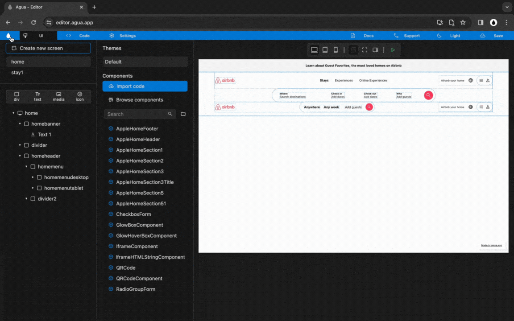
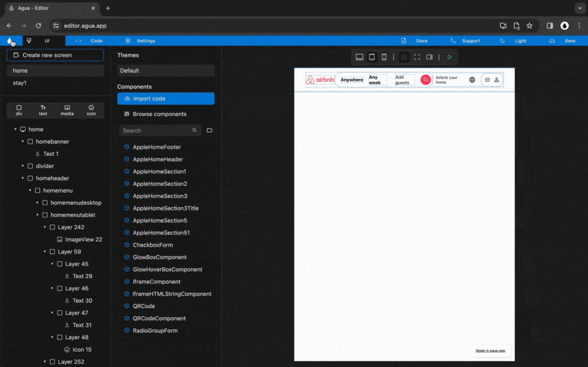

# 3.2 Tablet Menu

## 1. Structure



### `Div`, `Copy` and `Paste`.

<figure><figcaption></figcaption></figure>

### 1.1. Copy and paste "menulogo" into "homemenutablet":

`Ctrl C or Cmd C`

`Ctrl V or Cmd V`

### 1.2. Copy and paste "menuusers" into "homemenutablet":

`Ctrl C or Cmd C`

`Ctrl V or Cmd V`



### `Div`, `Size`, `Alignment`, and `Orientation`.

<figure><figcaption></figcaption></figure>

### **2.1.** Set "homemenutablet" _Size_ to:

Width_:_ `Fill`

Height: `Wrap`

### 2.2. Set "homemenutablet" _Alignment_ to:

`Main Axis center`

`Cross Axis distribute`

### 2.3. Set "homemenutablet" _Orientation_ to:

`Horizontal`

### **2.4.** Create a _Div_ with the name:

`menusearchtablet`



### `Name`.

### 3.1 Rename "menulogo" to:

`menulogotablet`

### 3.2 Rename "firstmenumedia1" to:

`menutabletmedia1`

### 3.3 Rename "firstmenutext4" to:

`menutablettext4`

### 3.4 Rename "firstmenuicon1" to:

`menutableticon1`

### 3.5 Rename "firstmenuicon2" to:

`menutableticon2`

### 3.6 Rename "firstmenuicon3" to:

`menutableticon1`



***

## 2. Elements



### `Div`, `Size`, and `Orientation`.

<figure><figcaption></figcaption></figure>

### **3.1.** Create 4 child _Divs_ inside of "menusearchtablet" with the names:

`menusearchtabletdiv1`

`menusearchtabletdiv2`

`menusearchtabletdiv3`

`menusearchtabletdiv4`

### **3.2.** Set "menusearchtablet" _Size_ to:

Width_:_ `Wrap`

Height: `Wrap`

### 3.3. Set "menusearchtablet" _Orientation_ to:

`Horizontal`



### `Text` , `Size`, and `Margin`.

### **4.1.** Create a _Text_ inside of "menusearchtabletdiv1":

`menusearchtablettext1`

### **4.2.** Set "menusearchtabletdiv1" _Size_ to:

Width_:_ `Wrap`

Height: `Wrap`

### 4.3. Set "menusearchtabletdiv1" _Margin_ to:

`Left: 10`

`Right: 10`

### **4.4.** Create a _Text_ inside of "menusearchtabletdiv2":

`menusearchtablettext2`

### **4.5.** Set "menusearchtabletdiv2" _Size_ to:

Width_:_ `Wrap`

Height: `Wrap`

### 4.6. Set "menusearchtabletdiv2" _Margin_ to:

`Left: 10`

`Right: 10`

### **4.7.** Create a _Text_ inside of "menusearchtabletdiv3":

`menusearchtablettext2`

### **4.8.** Set "menusearchtabletdiv3" _Size_ to:

Width_:_ `Wrap`

Height: `Wrap`

### 4.9. Set "menusearchtabletdiv3" _Margin_ to:

`Left: 10`

`Right: 10`

### **4.10.** Create an _Icon_ inside of "menusearchtabletdiv4":

`menusearchtableticon1`

### **4.11.** Set "menusearchtabletdiv4" _Size_ to:

Width_:_ `Wrap`

Height: `Wrap`

### 4.12. Set "menusearchtabletdiv3" _Margin_ to:

`Left: 10`



### `Text` and `Icon`.

### 5.1. Set "menusearchtablettext1" _Text_ to:

`Anywhere`

### 5.2. Set "menusearchtablettext2" _Text_ to:

`Any week`

### 5.3. Set "menusearchtablettext2" _Text_ to:

`Add guests`

### 5.4. Set "menusearchtableticon1" _Icon_ to:

`search`



***

## 3. Styling



### `Font Size`, `Text`, `Icon Size`, and `Icon Color`.

### 6.1. Set "menusearchtablettext1" _Font Size_ to:

`14`

### 6.2. Set "menusearchtablettext1" _Text_ to:

`[B] Bold`

### 6.3. Set "menusearchtablettext2" _Font Size_ to:

`14`

### 6.4. Set "menusearchtablettext2" _Text_ to:

`[B] Bold`

### 6.5. Set "menusearchtablettext3" _Font Size_ to:

`14`

### 6.6. Set "menusearchtableticon1" _Icon Size_ to:

`20`

### 6.7. Set "menusearchtableticon1" _Icon Color_ to:

`FFFFFF`



### `Background Color`, `Border Radius`, `Shadow`, and `Padding`.

###

### 6.1. Set "menusearchtabletdiv4" _Background Color_ to:

`FF385C`

### 6.2. Set "menusearchtabletdiv4" _Radius_ to:

`25`

### 6.3. Set "menusearchtabletdiv4" _Padding_ to:

`Top: 8`

`Bottom: 8`

`Left: 8`

`Right: 8`

### 6.4. Set "menusearchtablet" _Border Color_ to:

`E0E0E0`

### 6.5. Set "menusearchtablet" _Border Width_ to:

`1`

### 6.6. Set "menusearchtablet" _Radius_ to:

`50`

### 6.7. Set "menusearchtablet" _Shadow Blur_ to:

`5`

### 6.8. Set "menusearchtablet" _Shadow Color_ to:

`E0E0E0`



***

## 4. Responsive Visibility



### `Visibility`.

<figure><figcaption></figcaption></figure>

### 8.1. Unselect _Visibility_ of "homemenutablet"

### 8.2. Open _Tablet View_

### 8.3. Select _Visibility_ of "homemenutablet

### 8.4. Unselect _Visibility_ of "homemenudesktop"



***

## 5. Responsive Styling



### `Padding`.&#x20;

<figure><figcaption></figcaption></figure>

### 9.1. Open _Tablet View_

### 9.2. Set "homemenu" _Padding_ to:

`Top: 15`

`Bottom: 15`

`Left: 40`

`Right: 40`



### `Margin`.&#x20;

<figure><figcaption></figcaption></figure>

### 10.1. Open _Tablet View_

### 10.2. Set "menusearchtabletdiv2" _Margin_ to:

`Left: 10`

`Right: 10`



### `Image Source`, Image Size and `Text Size`.

<figure><figcaption></figcaption></figure>

### 11.1. Open _Tablet View_

### 11.2 Set "firstmenumedia1" _Image Source_ to:

`Assets/Brand/Airbnb_logo.png`




***

## 6. General Visibility



### `Visibility`.

<figure><figcaption></figcaption></figure>

### 12.1. Open _Mobile View_

### 12.2. Unselect _Visibility_ of "homemenutablet"

### 12.3. Unselect _Visibility_ of "homemenudesktop"



***
