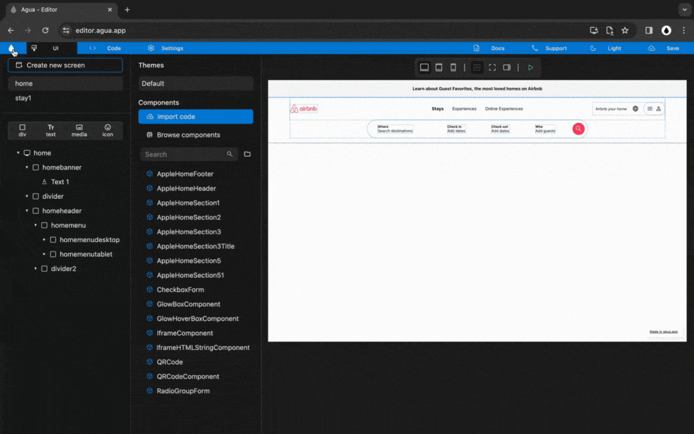

# 3.2 Tablet Menu

## 1. Structure



### `Div`, `Copy` and `Paste`.

<figure><figcaption></figcaption></figure>

### 1.1. Copy and paste "menulogo" into "homemenutablet":

`Ctrl C or Cmd C`

`Ctrl V or Cmd V`

### 1.2. Copy and paste "menuusers" into "homemenutablet":

`Ctrl C or Cmd C`

`Ctrl V or Cmd V`

### **1.3.** Create a _Div_ with the name:

`menusearchtablet`



### `Div`, `Size`, `Alignment`, and `Orientation`.

<figure><figcaption></figcaption></figure>

### **2.1.** Set "homemenutablet" _Size_ to:

Width_:_ `Fill`

Height: `Wrap`

### 2.2. Set "homemenutablet" _Alignment_ to:

`Main Axis center`

`Cross Axis distribute`

### 2.3. Set "homemenutablet" _Orientation_ to:

`Horizontal`

### **2.4.** Create a _Div_ with the name:

`menusearchdesktop`



***

## 2. Elements



<figure><figcaption></figcaption></figure>

### **3.1.** Create 4 child _Divs_ inside of "menusearchtablet" with the names:

`menusearchtabletdiv1`

`menusearchtabletdiv2`

`menusearchtabletdiv3`

`menusearchtabletdiv4`

`menusearchtabletdiv5`

### **3.2.** Set "menusearchtablet" _Size_ to:

Width_:_ `Wrap`

Height: `Wrap`

### 3.3. Set "menusearchtablet" _Orientation_ to:

`Horizontal`







***

## 3. Styling











***

## 4. Responsive Visibility



<figure><figcaption></figcaption></figure>



***

## 5. Responsive Styling



<figure><figcaption></figcaption></figure>



<figure><figcaption></figcaption></figure>



<figure><figcaption></figcaption></figure>



***

## 6. General Visibility



<figure><figcaption></figcaption></figure>



***
