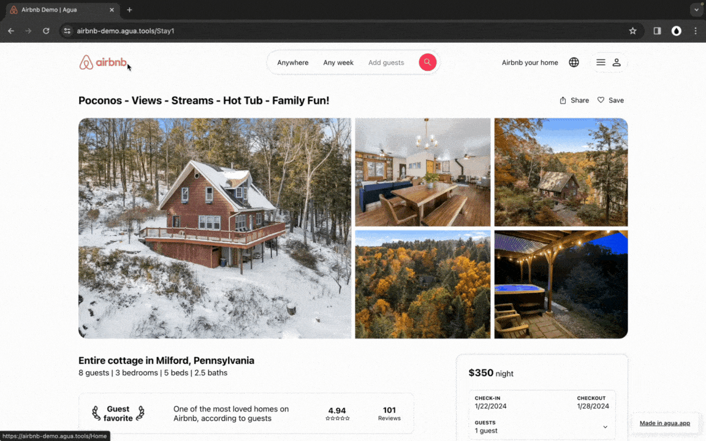

# Tutorial: Creating AirBnb

#### In this tutorial, **you’ll build the UI of**  [**Airbnb**](https://www.airbnb.com/)**.**&#x20;

You will replicate Airbnb's Front-end for a user who is looking for a cabin in New York. User interaction start at Airbnbs homepage and follows the information page of a particular Stay. The interface is built responsive and uses a component design approach.



<table data-card-size="large" data-view="cards"><thead><tr><th align="center"></th><th align="center"></th><th data-hidden data-card-target data-type="content-ref"></th></tr></thead><tbody><tr><td align="center"><a href="https://github.com/Agua-for-devs/agua-airbnb-demo"><strong>Fork our GitHub Repo and build it yourself:</strong></a></td><td align="center">Access all the required Assets.</td><td><a href="https://github.com/Agua-for-devs/agua-airbnb-demo">https://github.com/Agua-for-devs/agua-airbnb-demo</a></td></tr><tr><td align="center"><a href="https://github.com/Agua-for-devs/agua-airbnb-demo-deploy"><strong>Explore our finished Agua project:</strong></a></td><td align="center">See how is done.</td><td><a href="https://github.com/Agua-for-devs/agua-airbnb-demo-deploy">https://github.com/Agua-for-devs/agua-airbnb-demo-deploy</a></td></tr></tbody></table>

***

## Lessons


## You will learn:

### 1. Create the Home Screen

* [Banner](home/1.-banner.md)
* [Divider](home/2.-divider.md)

#### 1.1 Header

* [Desktop Menu](home/3.-header/3.1-desktop-menu.md)
* [Tablet Menu](home/3.-header/3.2-tablet-menu.md)



***

## Demo Tour

### Homepage Tour



<figure><figcaption>
<a href="https://airbnb-demo.agua.tools/Home">https://airbnb-demo.agua.tools/Home</a>
</figcaption></figure>



<figure><figcaption>
<a href="https://airbnb-demo.agua.tools/Stay1">https://airbnb-demo.agua.tools/Stay1</a>
</figcaption></figure>



<figure><figcaption>
<a href="https://airbnb-demo.agua.tools/Stay1photos">https://airbnb-demo.agua.tools/Stay1photos</a>
</figcaption></figure>



### Stay Tour



<figure><figcaption>
<a href="https://airbnb-demo.agua.tools/Home">https://airbnb-demo.agua.tools/Home</a>
</figcaption></figure>



<figure><figcaption>
<a href="https://airbnb-demo.agua.tools/Stay1">https://airbnb-demo.agua.tools/Stay1</a>
</figcaption></figure>



<figure><figcaption>
<a href="https://airbnb-demo.agua.tools/Stay1photos">https://airbnb-demo.agua.tools/Stay1photos</a>
</figcaption></figure>



***

## Project Files

After you have forked and cloned locally our [Demo Repo](https://github.com/Agua-for-devs/agua-airbnb-demo), you will be able to:

\
[A](./#a.-open-project). Open your new project in [https://editor.agua.app/](https://editor.agua.app/)

[B.](./#b.-review-assets) Review the provided assets or add any additional file.&#x20;

[C.](./#c.-review-sample-texts) Review or update the sample texts used our the [Airbnb Demo Project](https://airbnb-demo.agua.tools/). (Just copy & paste 😉)



<figure><figcaption></figcaption></figure>



<figure><figcaption></figcaption></figure>



<figure><figcaption></figcaption></figure>



***
