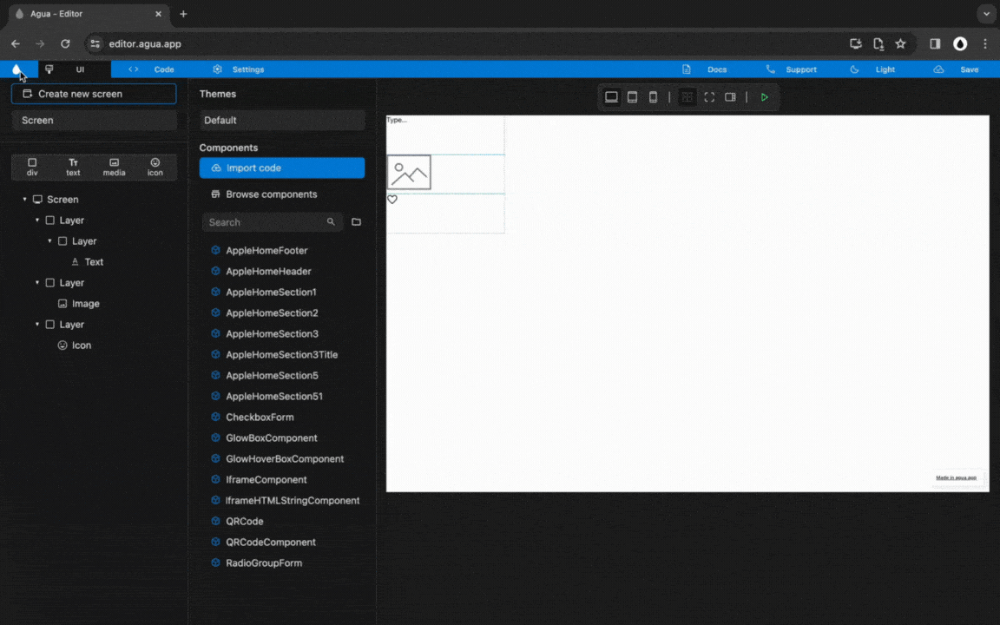

# Navigation Menu



<figure><figcaption></figcaption></figure>



## 1.1. Dashbord

Clicking on the Agua Logo will open your [dashboard](https://console.agua.app/) in a new tab.

## 1.2. UI

## 1.3. Code

## 1.4. Settings

## 1.5. Docs



<figure><figcaption></figcaption></figure>



***

## 1.6. Support



<figure><figcaption></figcaption></figure>



***

## 1.7. Theme



<figure><figcaption></figcaption></figure>



***

## 1.8. Save



<figure><figcaption></figcaption></figure>



***
