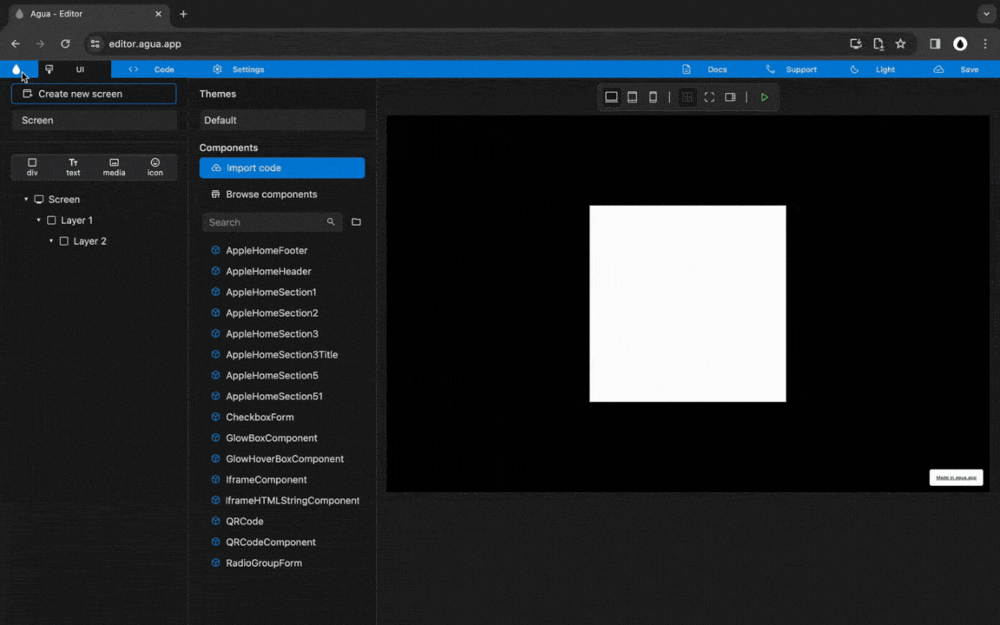

# Div

## Style

### HTML Tag

### Position

### Width

Min Width

Max Width

### Height

Min Height

Max Height

***

### Flex Wrap



<figure><figcaption></figcaption></figure>



***

## Borders



<figure><figcaption></figcaption></figure>



***

## Shadow



<figure><figcaption></figcaption></figure>



***

## Radius



<figure><figcaption></figcaption></figure>



## Events

## CSS

