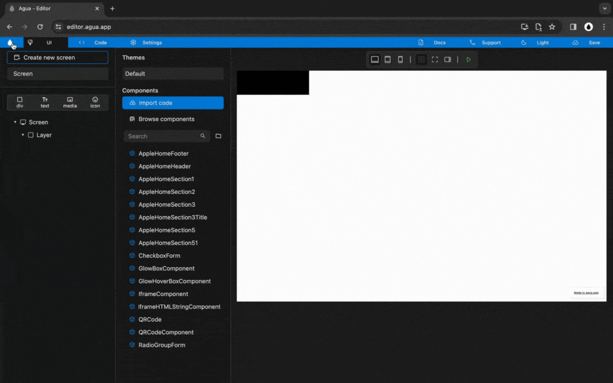
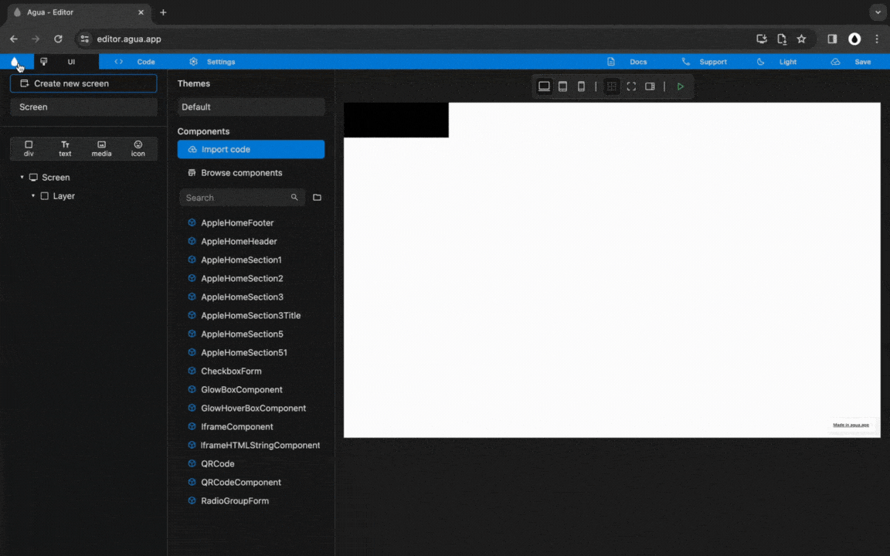
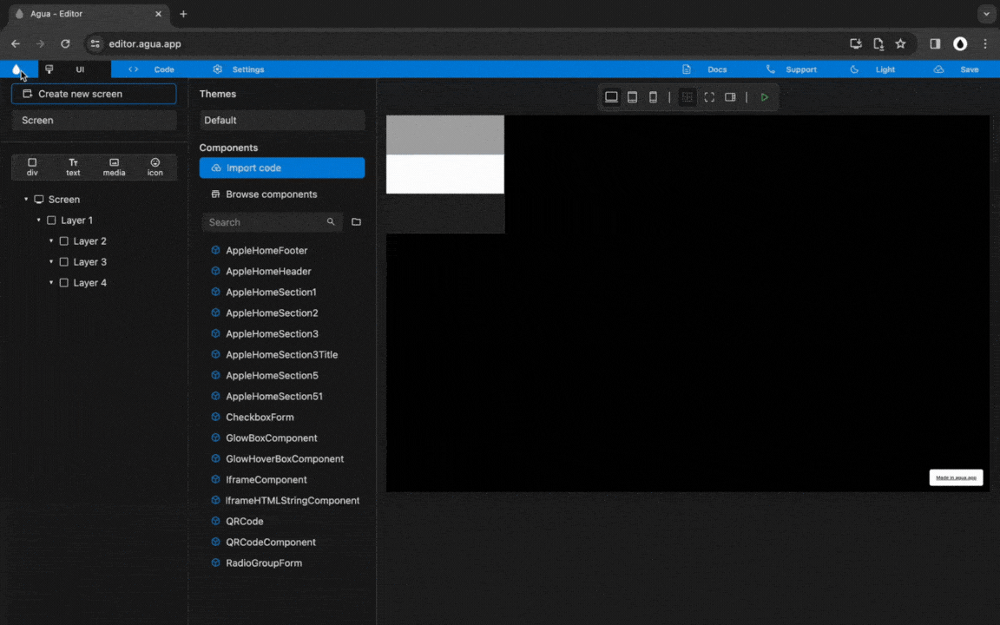
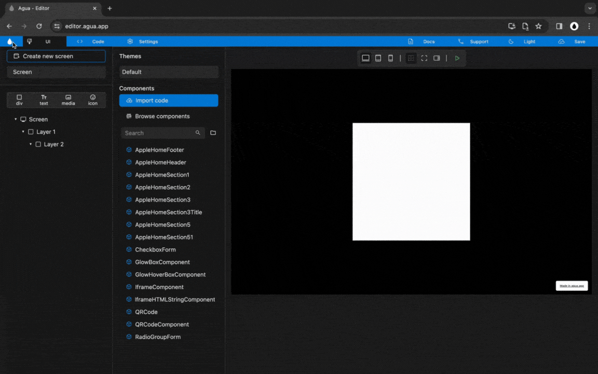
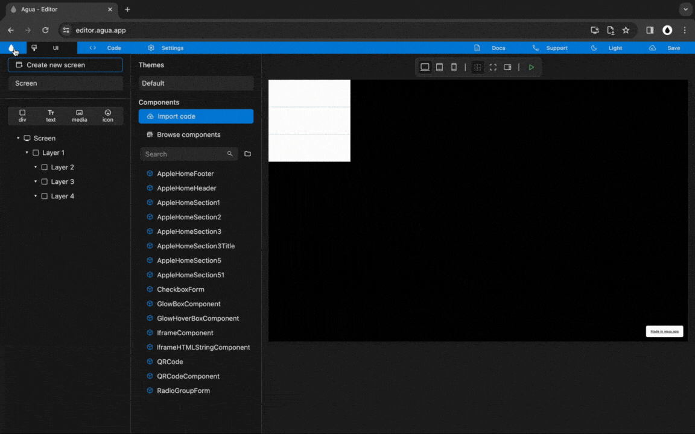
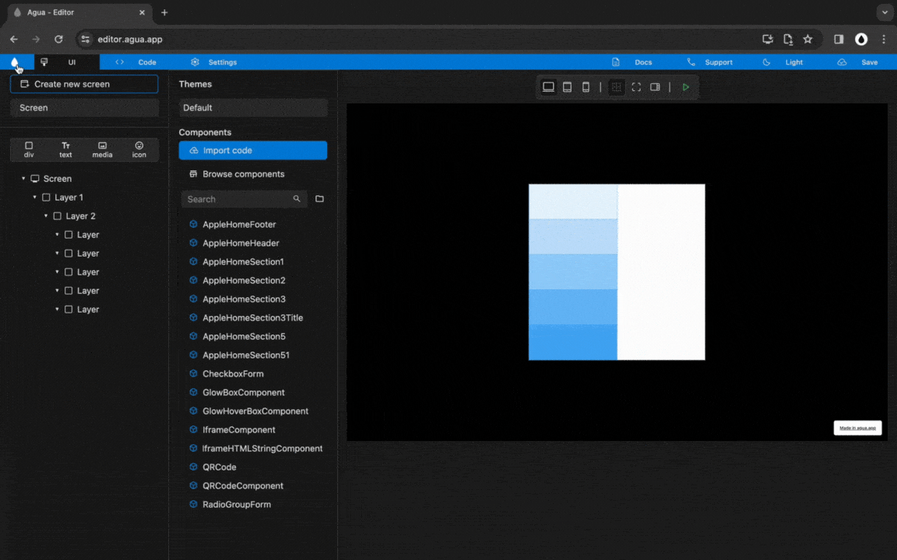
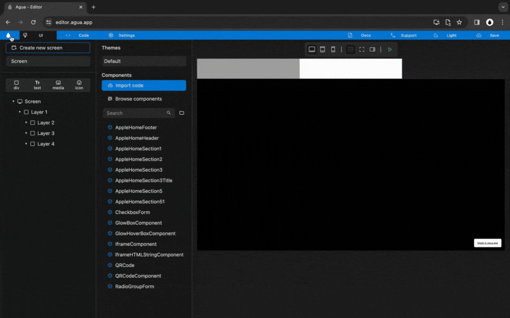

# Style

## 1. Variant

Defines different versions of a component or set of elements, that can be reused with slight variations in appearance, behavior, or functionality.

***

## 2. Classes

Defines an object's characteristics. Class is a template definition of an object's properties and methods. [\["\]](https://developer.mozilla.org/en-US/docs/Glossary/Class)\
\
Out of the current state of an element, new classes can be created with particular set of properties.

***

## 3. Size Units

### 3.1. Fixed



<figure><figcaption></figcaption></figure>



#### `px`

_One pixel. For screen displays represents one device pixel (dot)._ [\["\]](https://developer.mozilla.org/en-US/docs/Web/CSS/length#px)

#### `vw`

_Represents a percentage of the width of the viewport's initial containing block._ `1vw` _is_ `1%` _of the viewport width._ [\["\]](https://developer.mozilla.org/en-US/docs/Web/CSS/length#vw)

#### `vh`

_Represents a percentage of the height of the viewport's initial containing block._ `1vh` _is_ `1%` _of the viewport height._ [\["\]](https://developer.mozilla.org/en-US/docs/Web/CSS/length#vh)

#### `%`

_Represents a percentage of the width or height of an element's parent object._ [\["\]](https://developer.mozilla.org/en-US/docs/Web/CSS/percentage)

### 3.2. Wrap



<figure><figcaption></figcaption></figure>



_Behaves as_ `fit-content(stretch)`_. This means that the box size  is calculated based on the content size, while it also considers the maximum and minimum sizes defined for the content​._ [\["\]](https://developer.mozilla.org/en-US/docs/Web/CSS/fit-content)

### 3.3. Fill



<figure><figcaption></figcaption></figure>



&#x20;`100%` _of an element's parent object size._

***

## 4. Visibility



<figure><figcaption></figcaption></figure>



_Behaves as_ `display: none;`. _Turns off the display of an element so that it has no effect on layout (the document is rendered as though the element did not exist). All descendant elements also have their display turned off._ [\["\]](https://developer.mozilla.org/en-US/docs/Web/CSS/display#none)

***

## 5. Cursor



<figure><figcaption></figcaption></figure>



_Sets the mouse cursor, if any, to show when the mouse pointer is over an element._\
_Behaves as_ `display: none;`_. The cursor is a pointer that indicates a link. Typically an image of a pointing hand._ [\["\]](https://developer.mozilla.org/en-US/docs/Web/CSS/cursor)

***

## 6. Alignment



<figure><figcaption></figcaption></figure>



Sets the distribution of space between and around content items along a [flexbox](https://developer.mozilla.org/en-US/docs/Web/CSS/CSS\_flexible\_box\_layout)'s cross-axis.

### 6.1. Main Axis

#### Main Axis start:

Defaults to `justify-content: flex-start;`. [\["\]](https://developer.mozilla.org/en-US/docs/Web/CSS/justify-content#start)

#### Main Axis center:

Sets to `justify-content: center;`. [\["\]](https://developer.mozilla.org/en-US/docs/Web/CSS/justify-content#center)

#### Main Axis end:

Sets to `justify-content: flex-end;`. [\["\]](https://developer.mozilla.org/en-US/docs/Web/CSS/justify-content#end)

#### Main Axis distribute:

Sets to `justify-content: space-between;`. [\["\]](https://developer.mozilla.org/en-US/docs/Web/CSS/justify-content#space-between)

### 6.2. Cross Axis

#### Cross Axis start:

Defaults to `align-items: flex-start;`. [\["\]](https://developer.mozilla.org/en-US/docs/Web/CSS/align-content#start)

#### Cross Axis center:

Sets to `align-items: center;`. [\["\]](https://developer.mozilla.org/en-US/docs/Web/CSS/align-content#center)

#### Cross Axis end:&#x20;

Sets to `align-items: flex-end;`. [\["\]](https://developer.mozilla.org/en-US/docs/Web/CSS/align-content#end)

#### Cross Axis distribute:&#x20;

Sets to `align-items: space-between;`. [\["\]](https://developer.mozilla.org/en-US/docs/Web/CSS/align-content#space-between)

***

## 7. Orientation (flex-direction)



<figure><figcaption></figcaption></figure>



_Defaults to_ `flex-direction: column;`_.  Can also be set to_ `flex-direction: row;`_._

***

## 8. Scrollable (overflow)



<figure><figcaption></figcaption></figure>



Sets to `overflow: scroll;`. Overflow content is clipped at the element's padding box, and overflow content can be scrolled into view using scroll bars. User agents display scroll bars in the direction the element is set. [\["\]](https://developer.mozilla.org/en-US/docs/Web/CSS/overflow)

***

## 9. Background

### 9.1. Transparent

_Defaults to_ `background-color: transparent;`.

### 9.2. Fill



<figure><figcaption></figcaption></figure>



_Defaults to a Material color:_

`background-color: #FFFFFF;`

Can also be set to a Linear Gradient:

`background:linear-gradient(deg, rgb(,,) 0%,rgb(,,) 0%,rgb(,,) 0%);`

### 9.3. Image

Sets one background image on an element. it can can be either in PNG, JPEG, or JPG format.

***

## 10. Padding



<figure><figcaption></figcaption></figure>



Creates extra space _within_ an element. [\["\]](https://developer.mozilla.org/en-US/docs/Web/CSS/padding)

***

## 11. Margin



<figure><figcaption></figcaption></figure>



Creates extra space _around_ an element. [\["\]](https://developer.mozilla.org/en-US/docs/Web/CSS/margin)

***

