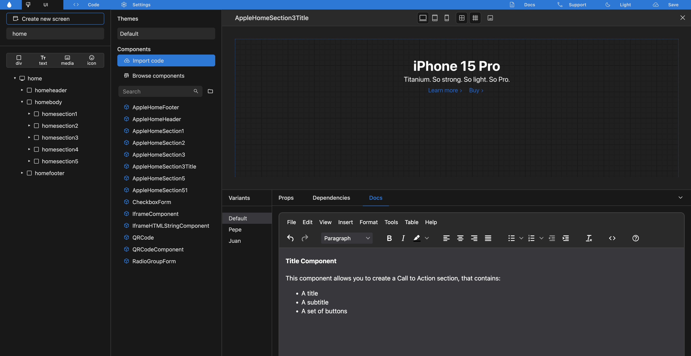
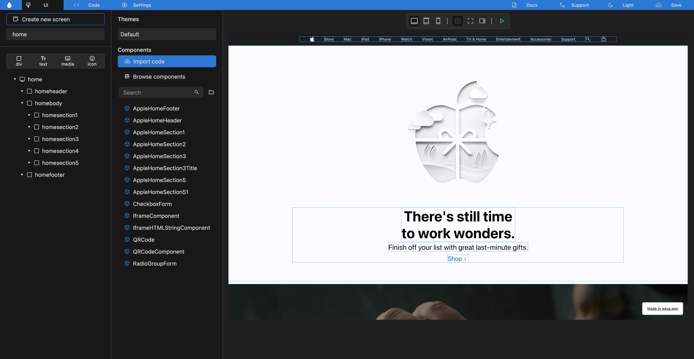
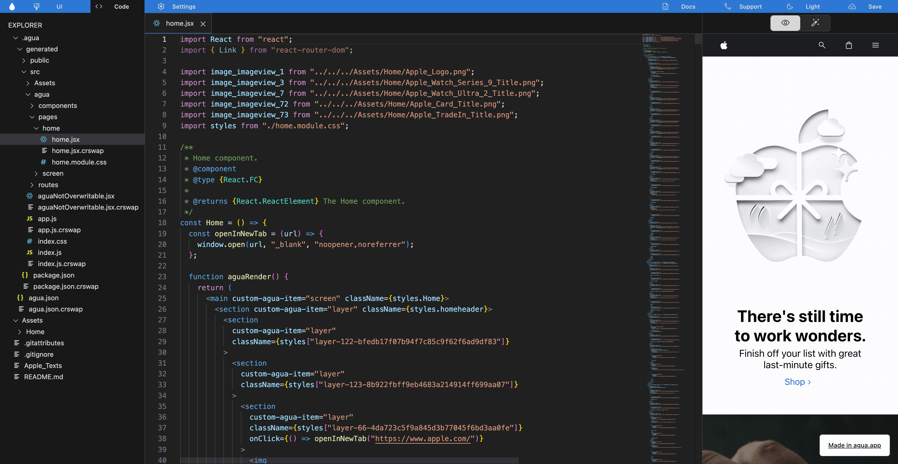
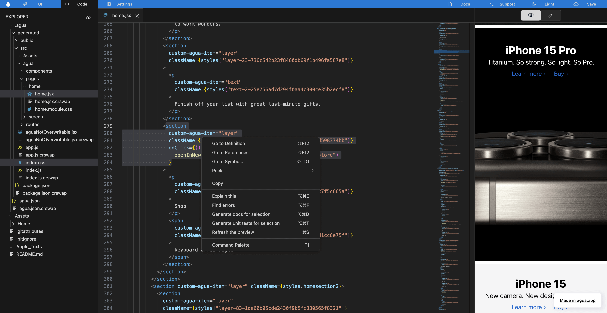

# Docs

## What is Agua?

Agua is the **free** React Toolkit for front-end developers. You can import, manage and document your components ing our AI tools, while using our Graphical Interface to updated and create new **web** user interfaces. **Develop clean code faster and easier!**



**Import your** [**components**](components/components-overview.md)**, and use our preview to: create variants and document them.**

<figure><figcaption></figcaption></figure>





Use your components to update an create new responsive user interfaces.\
Stylize using the CSS properties of our [graphical editor](fundamentals/ui-editor.md).

<figure><figcaption></figcaption></figure>





All the interfaces you created in our UI editor, are automatically exported into [clean React code](code-editor/code-overview.md).

<figure><figcaption></figcaption></figure>





Use our [AI tools](code-editor/ai-overview.md) to document components, find errors, explain your code to your team, and generate unit tests.

<figure><figcaption></figcaption></figure>



<table data-card-size="large" data-view="cards"><thead><tr><th></th><th></th><th></th><th data-hidden data-card-target data-type="content-ref"></th></tr></thead><tbody><tr><td></td><td>Learn how to <a href="introduction/get-started/"><strong>get started</strong></a>!</td><td></td><td><a href="introduction/get-started/">get-started</a></td></tr><tr><td></td><td>Try Agua now with our <a href="https://github.com/Agua-for-devs/agua-apple-demo"><strong>Demo</strong></a><strong>!</strong></td><td></td><td><a href="https://github.com/Agua-for-devs/agua-apple-demo">https://github.com/Agua-for-devs/agua-apple-demo</a></td></tr></tbody></table>

## Need Help?

Contact us directly!

* Email [support@agua.dev](mailto:support@agua.dev).
* Book a [meeting with our founders](https://agua.tools/meetings/developers/onboarding).
* Chat with us on [WhatsApp](https://wa.me/12396883277).

Also,

* Visit your [Youtube Channel](https://www.youtube.com/@aguafordevs).
* Check out our [FAQ](help-and-community/faq.md).
* Ask our [community](https://discord.com/invite/hqgEhc8VFN).


**Help us improve our docs!**

* If there are any topics you'd like us to add to our documentation, please share your feedback in our [Roadmap](https://roadmap.agua.app/).
* Edit this page in our [GitHub Repo](https://github.com/Agua-for-devs/agua-documentation) to fix an error or add an improvement to our documentation in a merge request.

