# Get started

## Create an account.

Create your free account to get started with Agua. After you've set up your account you'll be able to create as many projects as you like.


## Basic Requirements.

Agua is a web app that can be used from your browser.\
Please review these system requirements for the best experience:


* Building on any laptop or desktop is currently supported.
* Agua works only in [Google Chrome](https://www.google.com/intl/es-419/chrome/).
* Allow **editor.agua.app** to [edit the files in your local repository](./#6.-grant-files-permission.).



## Step-by-step

### 1. Access our Web App .



<figure>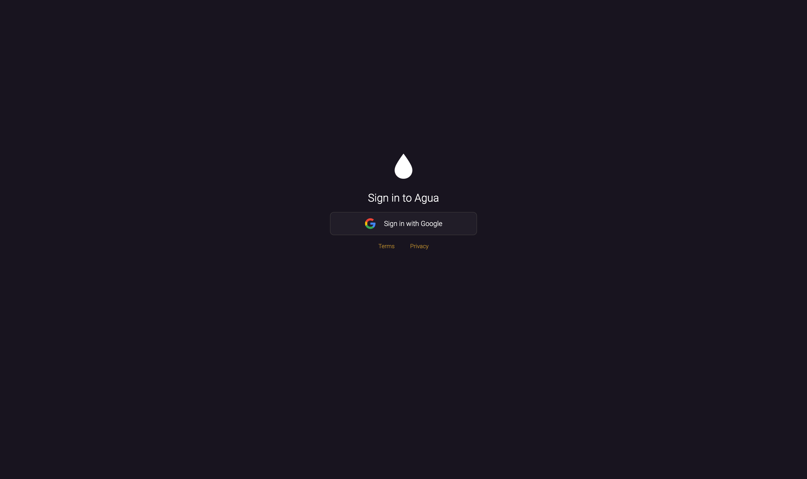<figcaption></figcaption></figure>

Enter [auth.agua.app](https://auth.agua.app/signin/).



### &#x20;2. Sign up with Google.



<figure>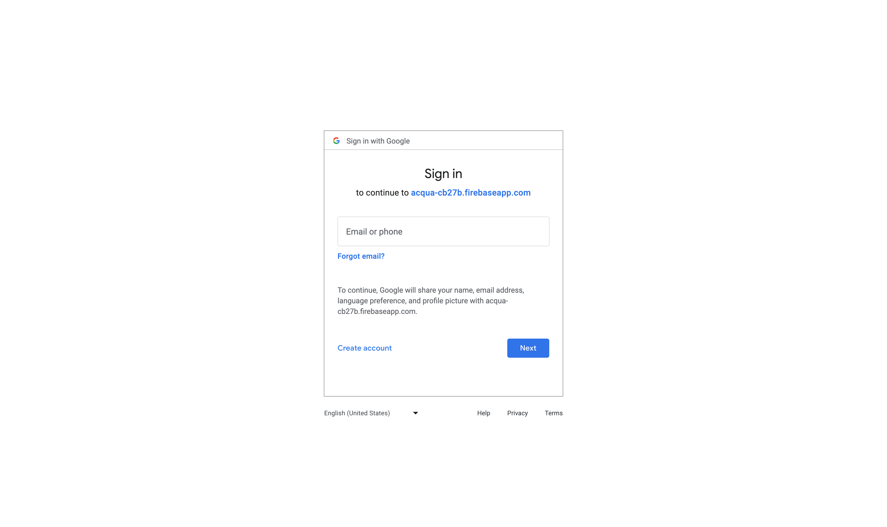<figcaption></figcaption></figure>



### 3.  Click \[_Open Editor_].



<figure>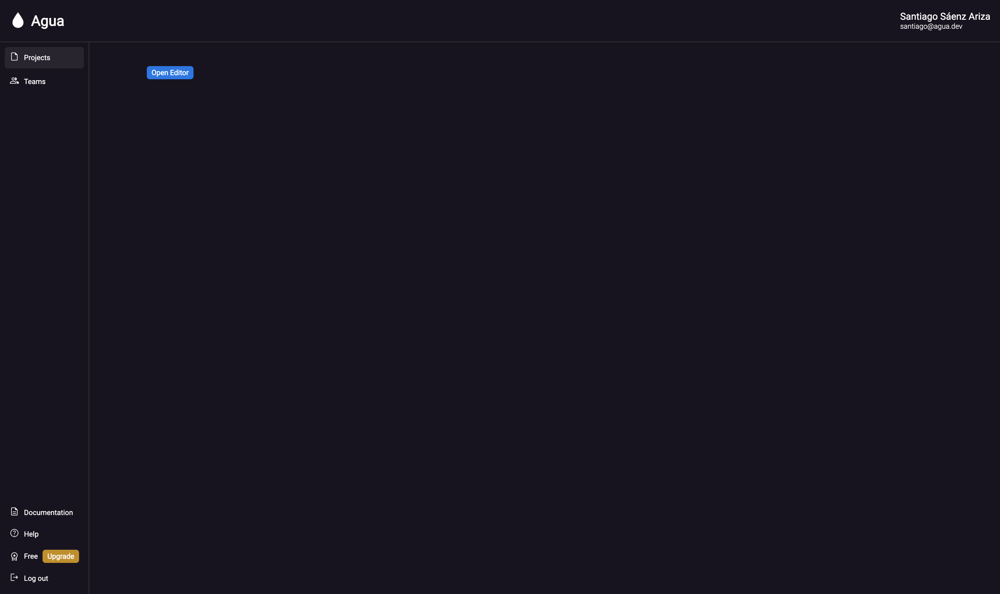<figcaption></figcaption></figure>

Inside your [dashboard](https://console.agua.app/), you'll be able to create new projects by clicking the \[_Open Editor_] button.&#x20;

You can also access:

* \[[_Documentation_](https://docs.agua.dev/)]
* \[[_Help_](https://wa.me/12396883277)]



### 4. Click \[_**Open folder**_**].**



<figure>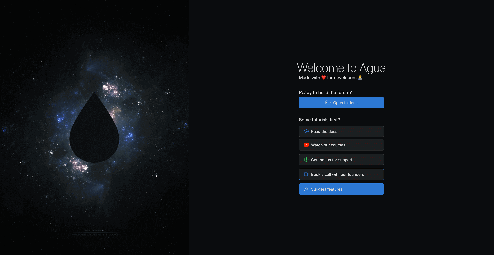<figcaption></figcaption></figure>

The \[**Open folder]** button will allow you connect a [local GitHub Repo](https://docs.github.com/en/get-started/quickstart/hello-world) with a new Agua project.\
\
You can also access:

* Our Documentation \[[_Read the docs_](https://docs.agua.dev/)]
* Out Tutorials \[[_Watch our courses_](https://www.youtube.com/@aguafordevs)]
* Our WhatsApp contact \[[_Contact us for support_](https://wa.me/12396883277)]
* Our one-to-one onboarding \[[_Book a call with our founders_](https://agua.tools/meetings/developers/onboarding)]



<figure>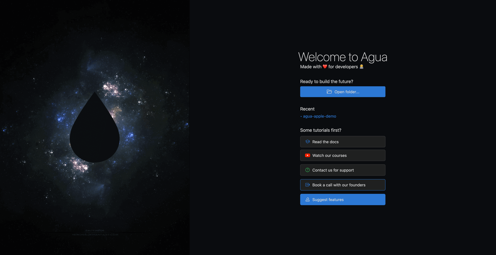<figcaption></figcaption></figure>

Once you have created previous projects, the _Recent_ section will allow you to see the title of each one, access it directly.



### 5. Locate your folder.



<figure><figcaption></figcaption></figure>

Your Finder or File Explorer will pop-up and you will be able to select your destiny folder.&#x20;

1. In case you are building a project from scratch, you just need to create a new folder.
2. In case your project is already running, you can select a folder where your previous components and UI assets are located. As seen in the [components section](../../components/components-overview.md) those components will automatically be imported into Agua and our preview.



### 6. Grant files permission.



<figure>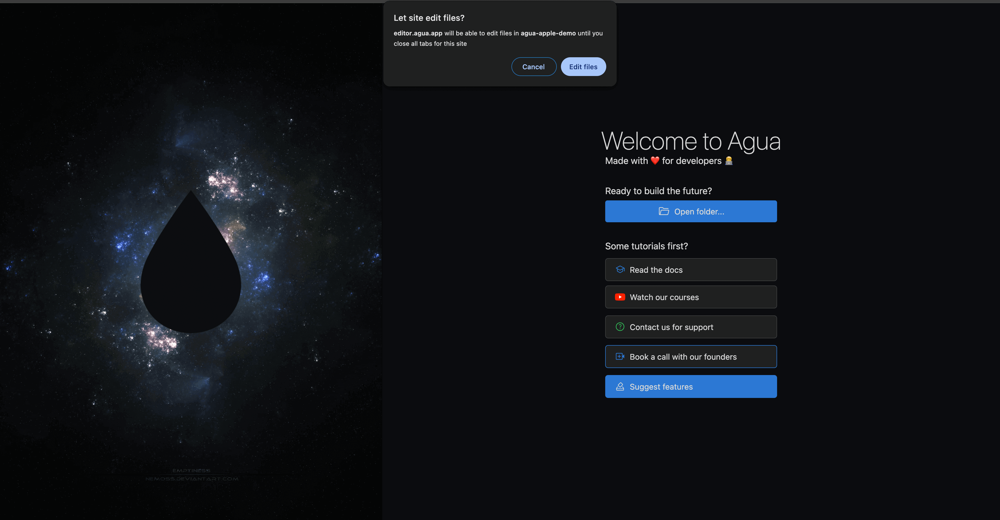<figcaption></figcaption></figure>

Given our Google Chrome integration, you will have to grant your Agua projects access to securely edit your files in the selected folder. For keeping your privacy and the integrity of your files, the access must be renewed each time the project tab is refreshed.



### 7. Access your project.



<figure>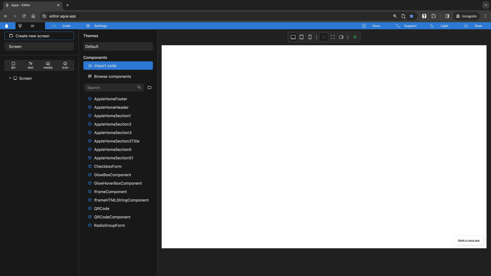<figcaption></figcaption></figure>

With your local folder selected, you will be access the [Agua Editor](https://editor.agua.app/). You will be presented with either a blank interfaces, or with the latest edits and components from your running project.



### 8. Save the project.



<figure>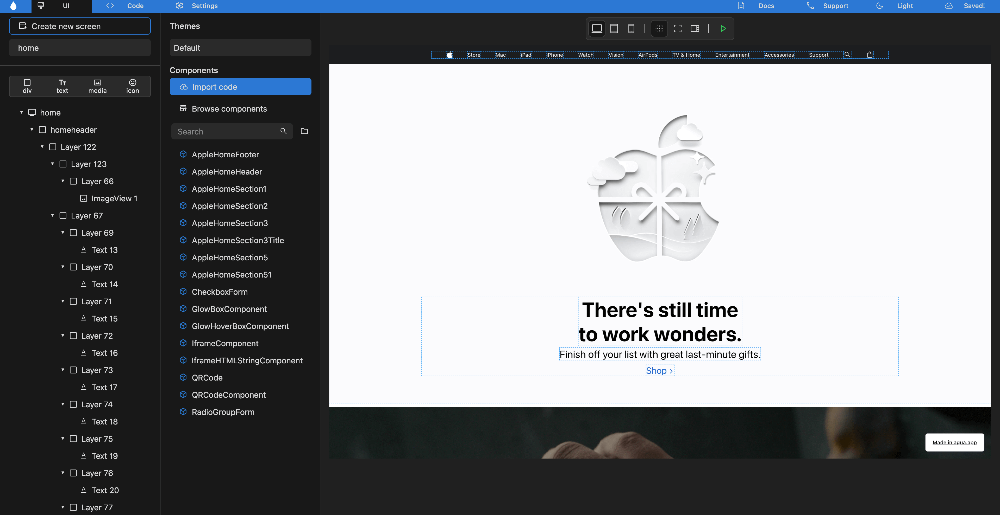<figcaption></figcaption></figure>

Ones you have edited your components or user interfaces, you should click the \[_Save_] button in the upper right side of the screen. The button will be updated into \[Saved!] making sure your code is now saved and updated into your local folder.



### 9. Review your code.



<figure>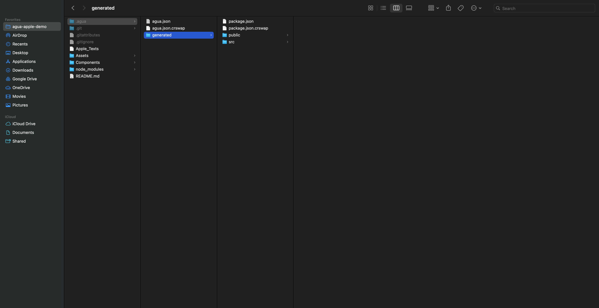<figcaption></figcaption></figure>

With your project saved, you can review your code in the selected local folder.\
Your code will be saved in the `.agua` folder.

Within the folder, you will find:

* `agua.json` where your Agua project is saved.
* `generated` where the React code automatically generated by our UI Editor and the code of the your components are saved.&#x20;


In Mac you may no be able to visualize your folder right away, in that case:&#x20;

1. Press the “Command” + “Shift” + “.” (period) keys at the same time.
2. `.agua` will show up as translucent in the local folder.

You can also:&#x20;

1. Click **Spotlight** (the magnifying glass icon in the toolbar or in Finder) and search for **Terminal**. Click the **Terminal** app, which should be the first result. Or, open Finder and navigate to **Applications** > **Utilities** > **Terminal**.
2. In the Terminal text box, type the following script:\
   `defaults write com.apple.Finder AppleShowAllFiles true`\
   (This instructs Finder to reveal all of the hidden files on your Mac.)
3. Then type: `killall Finder`\
   **(**This will restart Finder and apply the changes you made.)


In Windows:

1. Select View > Show > Hidden items.
2. `.agua` will show up as translucent in the local folder.



### 10. Deploy your project locally.&#x20;



<figure>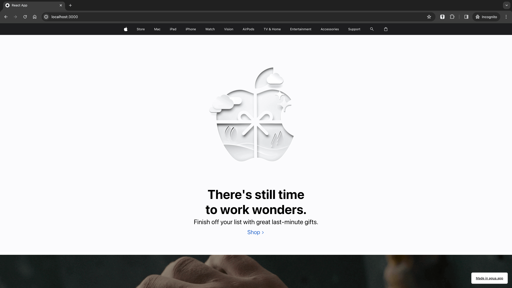<figcaption></figcaption></figure>

In order to deploy your Agua project locally open the folder in your favorite IDE:

* Replace in the `package.json` the following `"scripts"`:

```json
"start": "react-scripts --openssl-legacy-provider start",
"build": "react-scripts --openssl-legacy-provider build",
```

<figure>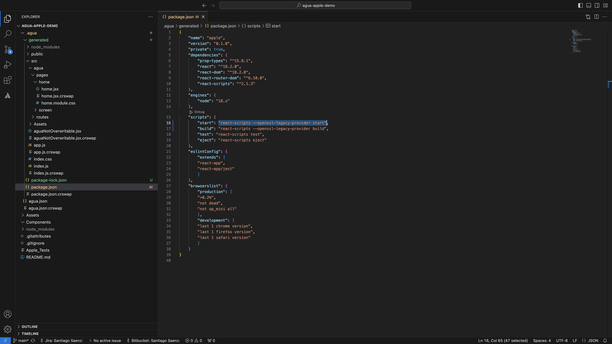<figcaption></figcaption></figure>

Then, inside the Terminal:

* `npm install`
* `npm start`

Finally, open your respective localhost tab in Google Chrome.




<table data-card-size="large" data-view="cards"><thead><tr><th></th><th></th><th></th><th data-hidden data-card-target data-type="content-ref"></th></tr></thead><tbody><tr><td></td><td>Learn more about <a href="../../components/components-overview.md"><strong>Components</strong></a><strong>.</strong></td><td></td><td><a href="../../components/components-overview.md">components-overview.md</a></td></tr><tr><td></td><td>Learn more about our <a href="../../fundamentals/ui-editor.md">UI Editor</a><strong>.</strong></td><td></td><td><a href="../../fundamentals/ui-editor.md">ui-editor.md</a></td></tr><tr><td></td><td>Learn more about our <a href="../../code-editor/code-overview.md"><strong>Code Editor</strong></a><strong>.</strong></td><td></td><td><a href="../../code-editor/code-overview.md">code-overview.md</a></td></tr><tr><td></td><td>Learn more about our <a href="../../code-editor/ai-overview.md">AI Tools</a><strong>.</strong></td><td></td><td><a href="../../code-editor/ai-overview.md">ai-overview.md</a></td></tr></tbody></table>


## Need Help?

Contact us directly!

* Email [support@agua.dev](mailto:support@agua.dev).
* Book a [meeting with our founders](https://agua.tools/meetings/developers/onboarding).
* Chat with us on [WhatsApp](https://wa.me/12396883277).



**Help us improve our docs!**

* If there are any topics you'd like us to add to our documentation, please share your feedback in our [Roadmap](https://roadmap.agua.app/).
* Edit this page in our [GitHub Repo](https://github.com/Agua-for-devs/agua-documentation) to fix an error or add an improvement to our documentation in a merge request.

